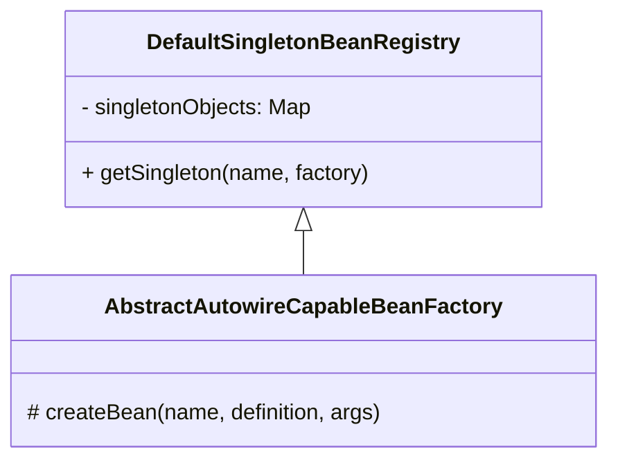

<!-- START doctoc generated TOC please keep comment here to allow auto update -->
<!-- DON'T EDIT THIS SECTION, INSTEAD RE-RUN doctoc TO UPDATE -->
**Table of Contents**  *generated with [DocToc](https://github.com/thlorenz/doctoc)*

- [1.函数式编程简介](#1%E5%87%BD%E6%95%B0%E5%BC%8F%E7%BC%96%E7%A8%8B%E7%AE%80%E4%BB%8B)
  - [1.2 概述](#12-%E6%A6%82%E8%BF%B0)
  - [1.2 合格的函数](#12-%E5%90%88%E6%A0%BC%E7%9A%84%E5%87%BD%E6%95%B0)
  - [1.3 函数与方法](#13-%E5%87%BD%E6%95%B0%E4%B8%8E%E6%96%B9%E6%B3%95)
  - [1.4 函数化为对象](#14-%E5%87%BD%E6%95%B0%E5%8C%96%E4%B8%BA%E5%AF%B9%E8%B1%A1)
  - [1.5 行为参数化](#15-%E8%A1%8C%E4%B8%BA%E5%8F%82%E6%95%B0%E5%8C%96)
  - [1.6 延迟执行](#16-%E5%BB%B6%E8%BF%9F%E6%89%A7%E8%A1%8C)
- [2.函数对象](#2%E5%87%BD%E6%95%B0%E5%AF%B9%E8%B1%A1)
  - [2.1 函数对象表现形式](#21-%E5%87%BD%E6%95%B0%E5%AF%B9%E8%B1%A1%E8%A1%A8%E7%8E%B0%E5%BD%A2%E5%BC%8F)
    - [① Lambda 表达式](#%E2%91%A0-lambda-%E8%A1%A8%E8%BE%BE%E5%BC%8F)
    - [② 方法引用](#%E2%91%A1-%E6%96%B9%E6%B3%95%E5%BC%95%E7%94%A8)
    - [③ 练习](#%E2%91%A2-%E7%BB%83%E4%B9%A0)
  - [2.2 函数对象类型](#22-%E5%87%BD%E6%95%B0%E5%AF%B9%E8%B1%A1%E7%B1%BB%E5%9E%8B)
    - [① 函数式接口](#%E2%91%A0-%E5%87%BD%E6%95%B0%E5%BC%8F%E6%8E%A5%E5%8F%A3)
    - [② jdk中的函数式接口](#%E2%91%A1-jdk%E4%B8%AD%E7%9A%84%E5%87%BD%E6%95%B0%E5%BC%8F%E6%8E%A5%E5%8F%A3)
    - [③ 常见函数接口](#%E2%91%A2-%E5%B8%B8%E8%A7%81%E5%87%BD%E6%95%B0%E6%8E%A5%E5%8F%A3)
    - [④ 使用函数接口解决问题](#%E2%91%A3-%E4%BD%BF%E7%94%A8%E5%87%BD%E6%95%B0%E6%8E%A5%E5%8F%A3%E8%A7%A3%E5%86%B3%E9%97%AE%E9%A2%98)
  - [2.3 方法引用](#23-%E6%96%B9%E6%B3%95%E5%BC%95%E7%94%A8)
    - [① 类名::静态方法](#%E2%91%A0-%E7%B1%BB%E5%90%8D%E9%9D%99%E6%80%81%E6%96%B9%E6%B3%95)
    - [② 类名::非静态方法](#%E2%91%A1-%E7%B1%BB%E5%90%8D%E9%9D%9E%E9%9D%99%E6%80%81%E6%96%B9%E6%B3%95)
    - [③ 对象::非静态方法](#%E2%91%A2-%E5%AF%B9%E8%B1%A1%E9%9D%9E%E9%9D%99%E6%80%81%E6%96%B9%E6%B3%95)
    - [④ 类名::new](#%E2%91%A3-%E7%B1%BB%E5%90%8Dnew)
    - [⑤ this::非静态方法  & super::非静态方法](#%E2%91%A4-this%E9%9D%9E%E9%9D%99%E6%80%81%E6%96%B9%E6%B3%95---super%E9%9D%9E%E9%9D%99%E6%80%81%E6%96%B9%E6%B3%95)
    - [⑥ 比较](#%E2%91%A5-%E6%AF%94%E8%BE%83)
    - [⑦ 练习](#%E2%91%A6-%E7%BB%83%E4%B9%A0)
  - [2.4 闭包和柯里化](#24-%E9%97%AD%E5%8C%85%E5%92%8C%E6%9F%AF%E9%87%8C%E5%8C%96)
    - [2.4.1 什么是闭包](#241-%E4%BB%80%E4%B9%88%E6%98%AF%E9%97%AD%E5%8C%85)
    - [2.4.2 闭包的限制](#242-%E9%97%AD%E5%8C%85%E7%9A%84%E9%99%90%E5%88%B6)
    - [2.4.3 闭包的作用](#243-%E9%97%AD%E5%8C%85%E7%9A%84%E4%BD%9C%E7%94%A8)
  - [2.5 柯里化](#25-%E6%9F%AF%E9%87%8C%E5%8C%96)
    - [2.5.1 什么是柯里化](#251-%E4%BB%80%E4%B9%88%E6%98%AF%E6%9F%AF%E9%87%8C%E5%8C%96)
    - [2.5.2 柯里化的作用 和 实现](#252-%E6%9F%AF%E9%87%8C%E5%8C%96%E7%9A%84%E4%BD%9C%E7%94%A8-%E5%92%8C-%E5%AE%9E%E7%8E%B0)
  - [2.6 高阶函数](#26-%E9%AB%98%E9%98%B6%E5%87%BD%E6%95%B0)
    - [2.6.1 内循环](#261-%E5%86%85%E5%BE%AA%E7%8E%AF)
    - [2.6.2 二叉树遍历](#262-%E4%BA%8C%E5%8F%89%E6%A0%91%E9%81%8D%E5%8E%86)
    - [2.6.3 手写stream](#263-%E6%89%8B%E5%86%99stream)
      - [① stream（map、filter、forEach）](#%E2%91%A0-streammapfilterforeach)
      - [② stream（化简-reduce）](#%E2%91%A1-stream%E5%8C%96%E7%AE%80-reduce)
      - [③ stream（收集-collect）](#%E2%91%A2-stream%E6%94%B6%E9%9B%86-collect)
- [3.Stream API](#3stream-api)
  - [3.1 串行流](#31-%E4%B8%B2%E8%A1%8C%E6%B5%81)
    - [3.1.1 过滤 - filter](#311-%E8%BF%87%E6%BB%A4---filter)
    - [3.1.2 映射 - map](#312-%E6%98%A0%E5%B0%84---map)
    - [3.1.3 扁平化(降维) - flatMap](#313-%E6%89%81%E5%B9%B3%E5%8C%96%E9%99%8D%E7%BB%B4---flatmap)
    - [3.1.4 构建流](#314-%E6%9E%84%E5%BB%BA%E6%B5%81)
    - [3.1.5 合并与截取](#315-%E5%90%88%E5%B9%B6%E4%B8%8E%E6%88%AA%E5%8F%96)
    - [3.1.6 生成流](#316-%E7%94%9F%E6%88%90%E6%B5%81)
    - [3.1.7 查找与判断](#317-%E6%9F%A5%E6%89%BE%E4%B8%8E%E5%88%A4%E6%96%AD)
    - [3.1.8 去重与排序](#318-%E5%8E%BB%E9%87%8D%E4%B8%8E%E6%8E%92%E5%BA%8F)
    - [3.1.9 化简](#319-%E5%8C%96%E7%AE%80)
    - [3.1.10 收集](#3110-%E6%94%B6%E9%9B%86)
    - [3.1.11 收集器](#3111-%E6%94%B6%E9%9B%86%E5%99%A8)
    - [3.1.12 下游收集器](#3112-%E4%B8%8B%E6%B8%B8%E6%94%B6%E9%9B%86%E5%99%A8)
    - [3.1.13 基本类型流](#3113-%E5%9F%BA%E6%9C%AC%E7%B1%BB%E5%9E%8B%E6%B5%81)
    - [3.1.14 流的特性](#3114-%E6%B5%81%E7%9A%84%E7%89%B9%E6%80%A7)
    - [3.1.15 总结](#3115-%E6%80%BB%E7%BB%93)
  - [3.2 并行流](#32-%E5%B9%B6%E8%A1%8C%E6%B5%81)
- [4.应用案例](#4%E5%BA%94%E7%94%A8%E6%A1%88%E4%BE%8B)
  - [4.1 数据统计分析](#41-%E6%95%B0%E6%8D%AE%E7%BB%9F%E8%AE%A1%E5%88%86%E6%9E%90)
    - [4.1.1 分组统计](#411-%E5%88%86%E7%BB%84%E7%BB%9F%E8%AE%A1)
    - [4.1.2 区间统计](#412-%E5%8C%BA%E9%97%B4%E7%BB%9F%E8%AE%A1)
  - [4.2 异步处理](#42-%E5%BC%82%E6%AD%A5%E5%A4%84%E7%90%86)
  - [4.3 框架设计](#43-%E6%A1%86%E6%9E%B6%E8%AE%BE%E8%AE%A1)
    - [4.3.1 将实现逻辑交给子类](#431-%E5%B0%86%E5%AE%9E%E7%8E%B0%E9%80%BB%E8%BE%91%E4%BA%A4%E7%BB%99%E5%AD%90%E7%B1%BB)
    - [4.3.2 将实现逻辑交给用户](#432-%E5%B0%86%E5%AE%9E%E7%8E%B0%E9%80%BB%E8%BE%91%E4%BA%A4%E7%BB%99%E7%94%A8%E6%88%B7)
    - [4.3.3 延迟拼接条件](#433-%E5%BB%B6%E8%BF%9F%E6%8B%BC%E6%8E%A5%E6%9D%A1%E4%BB%B6)
  - [4.4 并行计算](#44-%E5%B9%B6%E8%A1%8C%E8%AE%A1%E7%AE%97)
  - [4.5 UI设计](#45-ui%E8%AE%BE%E8%AE%A1)
- [5.函数编程原理](#5%E5%87%BD%E6%95%B0%E7%BC%96%E7%A8%8B%E5%8E%9F%E7%90%86)
  - [5.1 Lambda 原理](#51-lambda-%E5%8E%9F%E7%90%86)
    - [5.1.2 第一步，生成静态方法](#512-%E7%AC%AC%E4%B8%80%E6%AD%A5%E7%94%9F%E6%88%90%E9%9D%99%E6%80%81%E6%96%B9%E6%B3%95)
    - [5.1.3 第二步，生成实现类字节码](#513-%E7%AC%AC%E4%BA%8C%E6%AD%A5%E7%94%9F%E6%88%90%E5%AE%9E%E7%8E%B0%E7%B1%BB%E5%AD%97%E8%8A%82%E7%A0%81)
  - [5.2 方法引用原理](#52-%E6%96%B9%E6%B3%95%E5%BC%95%E7%94%A8%E5%8E%9F%E7%90%86)
  - [5.3 闭包原理](#53-%E9%97%AD%E5%8C%85%E5%8E%9F%E7%90%86)
  - [5.4 流的构建与切分原理](#54-%E6%B5%81%E7%9A%84%E6%9E%84%E5%BB%BA%E4%B8%8E%E5%88%87%E5%88%86%E5%8E%9F%E7%90%86)

<!-- END doctoc generated TOC please keep comment here to allow auto update -->

## 1.函数式编程简介

说明：本教程基于jdk21

函数：函数即规则

### 1.2 概述

数学中的函数：


例如：

| INPUT | f(x) | OUTPUT |
| ----- | ---- | ------ |
| 1     | ?    | 1      |
| 2     | ?    | 4      |
| 3     | ?    | 9      |
| 4     | ?    | 16     |
| 5     | ?    | 25     |
| ...   | ...  | ...    |

* $f(x) = x^2$ 是一种规律， input 按照此规律变化为 output
* 很多规律已经由人揭示，例如 $e = m \cdot c^2$
* 程序设计中**更**可以自己去制定规律

* 一个函数，只要输入相同，无论多少次调用，无论什么时间调用，输出相同


### 1.2 合格的函数

1.**合格的函数**：输出仅依赖于输入参数，而不依赖于任何外部状态或可变数据。相同的输入总是返回相同的输出

```java
package com.itheima.day1;
// 演示【合格】的函数
public class Sample1 {
    public static void main(String[] args) {
        System.out.println(square(10));
        System.out.println(square(10));
        System.out.println(square(10));
        System.out.println(square(10));
        System.out.println(square(10));
    }

    static int square(int x) {
        return x * x;
    }
}
```

2.**不合格的函数**：以下pray 的执行结果，除了参数变化外，希望函数的执行规则永远不变

```java
// 演示【不合格】的函数
public class TestMutable {

    public static void main(String[] args) {
        System.out.println(pray("张三"));
        System.out.println(pray("张三"));
        System.out.println(pray("张三"));
    }

    static class Buddha {
        String name;

        public Buddha(String name) {
            this.name = name;
        }
    }

    static Buddha buddha = new Buddha("佛祖");

    static String pray(String person) {
        return (person + "向[" + buddha.name + "]虔诚祈祷");
    }
}
```

以上 pray 的执行结果，除了参数变化外，希望函数的执行规则永远不变

```
张三向[佛祖]虔诚祈祷
张三向[佛祖]虔诚祈祷
张三向[佛祖]虔诚祈祷
```

然而，由于设计上的缺陷，函数引用了外界可变的数据，如果这么使用

```java
buddha.name = "魔王";
System.out.println(pray("张三"));
```

结果就会是

```java
张三向[魔王]虔诚祈祷
```

问题出在哪儿呢？

- 函数引用了外界可变的数据，那么函数的输出就不仅仅依赖于函数的参数，也依赖于这个外界可变数据
- 函数的目的是除了参数能变化，其它部分都要不变，这样才能成为规则的一部分
- 不是说函数不能引用外界的数据，而是它引用的外部数据必须保持不变

- 佛祖要成为规则的一部分，也要保持不变。改正方法：

```java
static class Buddha {
    // final关键字修饰之后就是不可变的值
    final String name;

    public Buddha(String name) {
        this.name = name;
    }
}

或
    
// jdk16以上，使用record保证取值不变
record Buddha(String name) { }
```

### 1.3 函数与方法

成员方法本质上也是函数。不过成员方法绑定在对象之上，成员方法是对象个人法则

- 函数是：函数（对象数据，其它参数）


- 方法是：对象数据.方法（其它参数）


```java
package com.itheima.day1;
// 成员方法算不算函数？
public class Sample3 {

    static class Student {
        final String name;

        public Student(String name) {
            this.name = name;
        }

        public String getName() {
            return this.name;
        }
        // getName()  等价于  getName(Student this)
//        public String getName(Student this) {
//            return this.name;
//        }
    }

    public static void main(String[] args) {
        Student s1 = new Student("张三");
        System.out.println(s1.getName()); // getName(s1)
        System.out.println(s1.getName()); // getName(s1)

        Student s2 = new Student("李四");
        System.out.println(s2.getName()); // getName(s2)
        System.out.println(s2.getName()); // getName(s2)
        /*
            方法也算函数：成员方法有一个隐形的参数，这个参数就是this
         */
    }
}
```

### 1.4 函数化为对象

函数化为对象：

```java
package com.itheima.day1;
public class Sample4 {

    // 普通函数
    static int add(int a, int b) {
        return a + b;
    }

    interface Lambda {
        int calculate(int a, int b);
    }

    // 函数化为对象
    static Lambda add = (a, b) -> a + b;

    /*
     * 前者是纯粹的一条两数加法规则，它的位置是固定的，要使用它，需要通过 Sample4.add 找到它，然后执行
     * 而后者（add 对象）就像长了腿，它的位置是可以变化的，想去哪里就去哪里，哪里要用到这条加法规则，把它传递过去
     * 接口的目的是为了将来用它来执行函数对象，此接口中只能有一个方法定义
     */

    public static void main(String[] args) {
        System.out.println(Sample4.add(3, 4));

        System.out.println(add.calculate(5, 6));
    }

}
```

函数化为对象：下面的例子做了一些简单的扩展，可以看到不同的客户端可以上传自己的计算规则

```java
package com.itheima.day1;
import java.io.*;
import java.net.ServerSocket;
import java.net.Socket;
import java.util.concurrent.ThreadLocalRandom;
public class Sample5 {
    interface Lambda extends Serializable {
        int calculate(int a, int b);
    }

    // 服务器端代码
    static class Server {
        public static void main(String[] args) throws IOException {
            ServerSocket ss = new ServerSocket(8080);
            System.out.println("server start...");
            while (true) {
                Socket s = ss.accept();
                Thread.ofVirtual().start(() -> {
                    try {
                        ObjectInputStream is = new ObjectInputStream(s.getInputStream());
                        Lambda lambda = (Lambda) is.readObject();
                        int a = ThreadLocalRandom.current().nextInt(10);
                        int b = ThreadLocalRandom.current().nextInt(10);
                        System.out.printf("%s %d op %d = %d%n", s.getRemoteSocketAddress().toString(), a, b, lambda.calculate(a, b));
                    } catch (IOException | ClassNotFoundException e) {
                        throw new RuntimeException(e);
                    }
                });
            }
        }
    }

    // Server 虚拟机端必须有 Client0 这个类，相当于把实现绑定在了服务器端
    static class Client0 {
        int add(int a, int b) {
            return a + b;
        }
    }
    
    // Server 虚拟机端只需有 Lambda 接口定义，实现与服务器无关。具体实现取决于客户端
    static class Client1 {
        public static void main(String[] args) throws IOException {
            try(Socket s = new Socket("127.0.0.1", 8080)){
                Lambda lambda = (a, b) -> a + b;
                ObjectOutputStream os = new ObjectOutputStream(s.getOutputStream());
                os.writeObject(lambda);
                os.flush();
            }
        }
    }
    
     // Server 虚拟机端只需有 Lambda 接口定义，实现与服务器无关。具体实现取决于客户端
    static class Client2 {
        public static void main(String[] args) throws IOException {
            try(Socket s = new Socket("127.0.0.1", 8080)){
                Lambda lambda = (a, b) -> a - b;
                ObjectOutputStream os = new ObjectOutputStream(s.getOutputStream());
                os.writeObject(lambda);
                os.flush();
            }
        }
    }
    
     // Server 虚拟机端只需有 Lambda 接口定义，实现与服务器无关。具体实现取决于客户端
    static class Client3 {
        public static void main(String[] args) throws IOException {
            try(Socket s = new Socket("127.0.0.1", 8080)){
                Lambda lambda = (a, b) -> a * b;
                ObjectOutputStream os = new ObjectOutputStream(s.getOutputStream());
                os.writeObject(lambda);
                os.flush();
            }
        }
    }
}
```

### 1.5 行为参数化

行为参数化：函数当成一个参数使得函数更加通用

```java
package com.itheima.day1;
import java.util.ArrayList;
import java.util.Comparator;
import java.util.List;
import java.util.function.BiFunction;
// 函数对象好处1：行为参数化
public class Sample6 {
    public static void main(String[] args) {
        List<Student> students = List.of(
                new Student("张无忌", 18, "男"),
                new Student("杨不悔", 16, "女"),
                new Student("周芷若", 19, "女"),
                new Student("宋青书", 20, "男")
        );

        /*
            需求1：筛选男性学生
         */
        // 行为参数化
        System.out.println(filter0(students, student -> student.sex.equals("男")));

        /*
            需求2：筛选18岁以下学生
         */
        System.out.println(filter0(students, student -> student.age < 18));

        System.out.println(filter0(students, student -> student.sex.equals("女")));
    }

    interface Lambda {
        boolean test(Student student);
    }

    static List<Student> filter0(List<Student> students, Lambda lambda) {
        List<Student> result = new ArrayList<>();
        for (Student student : students) {
            if (lambda.test(student)) {
                result.add(student);
            }
        }
        return result;
    }

    /*
     需求1：筛选男性学生
     */
    // 参数 -> 逻辑部分   student -> student.sex.equals("男")
    static List<Student> filter(List<Student> students) {
        List<Student> result = new ArrayList<>();
        for (Student student : students) {
            if (student.sex.equals("男")) {
                result.add(student);
            }
        }
        return result;
    }

    /*
        需求2：筛选18岁以下学生
     */
    // student -> student.age < 18
    static List<Student> filter2(List<Student> students) {
        List<Student> result = new ArrayList<>();
        for (Student student : students) {
            if (student.age < 18) {
                result.add(student);
            }
        }
        return result;
    }

    static class Student {
        private String name;
        private int age;
        private String sex;

        public Student(String name, int age, String sex) {
            this.name = name;
            this.age = age;
            this.sex = sex;
        }

        public int getAge() {
            return age;
        }

        public String getName() {
            return name;
        }

        public String getSex() {
            return sex;
        }

        @Override
        public String toString() {
            return "Student{" +
                    "name='" + name + '\'' +
                    ", age=" + age +
                    ", sex='" + sex + '\'' +
                    '}';
        }
    }
}
```

### 1.6 延迟执行

完整例子：

```java
package com.itheima.day1;
import org.apache.logging.log4j.Level;
import org.apache.logging.log4j.LogManager;
import org.apache.logging.log4j.Logger;
import org.apache.logging.log4j.core.LoggerContext;
import org.apache.logging.log4j.core.appender.ConsoleAppender;
import org.apache.logging.log4j.core.config.Configurator;
import org.apache.logging.log4j.core.config.builder.api.AppenderComponentBuilder;
import org.apache.logging.log4j.core.config.builder.api.ConfigurationBuilder;
import org.apache.logging.log4j.core.config.builder.api.ConfigurationBuilderFactory;
import org.apache.logging.log4j.core.config.builder.impl.BuiltConfiguration;
// 函数对象好处2：延迟执行
public class Sample7 {
    static Logger logger = init(Level.DEBUG);

    public static void main(String[] args) {
        /*if (logger.isDebugEnabled()) {
            logger.debug("{}", expensive());
        }*/

        logger.debug("{}", expensive());        // expensive() 立刻执行

        logger.debug("{}", () -> expensive());  // 函数对象使得 expensive 延迟执行

    }

    static String expensive() {
        System.out.println("执行耗时操作...");
        return "日志";
    }

    static Logger init(Level level) {
        ConfigurationBuilder<BuiltConfiguration> builder = ConfigurationBuilderFactory.newConfigurationBuilder()
                .setStatusLevel(Level.ERROR)
                .setConfigurationName("BuilderTest");
        AppenderComponentBuilder appender =
                builder.newAppender("Stdout", "CONSOLE")
                        .addAttribute("target", ConsoleAppender.Target.SYSTEM_OUT)
                        .add(builder.newLayout("PatternLayout").addAttribute("pattern", "%d [%t] %-5level: %msg%n%throwable"));
        builder.add(appender)
                .add(builder.newRootLogger(level).add(builder.newAppenderRef("Stdout")));
        Configurator.initialize(builder.build());
        return LogManager.getLogger();
    }
}
```

**解读**：在记录日志时，假设日志级别是 INFO，debug 方法会遇到下面的问题：

* 本不需要记录日志，但 expensive 方法仍被执行了

```java
static Logger logger = LogManager.getLogger();

public static void main(String[] args) {
    System.out.println(logger.getLevel());
    logger.debug("{}", expensive());
}

static String expensive() {
    System.out.println("执行耗时操作");
    return "结果";
}
```

改进方法1：

```java
if(logger.isDebugEnabled())
    logger.debug("{}", expensive());
```

显然这么做，很多类似代码都要加上这样 if 判断，很不优雅

改进方法2：

在 debug 方法外再套一个新方法，内部逻辑大概是这样：

```java
public void debug(final String msg, final Supplier<?> lambda) {
    if (this.isDebugEnabled()) {
        this.debug(msg, lambda.get());
    }
}
```

调用时这样：

```java 
logger.debug("{}", () -> expensive());
```

expensive() 变成了不是立刻执行，在未来 if 条件成立时才执行

## 2.函数对象

### 2.1 函数对象表现形式

函数对象的两种表现形式：

- Lambda 表达式：功能更全面
- 方法引用：写法更简洁

####  ① Lambda 表达式

Lambda 表达式语法：

```java
// 明确指出参数类型
(int a,int b) -> a + b;

// 代码多于一行，不能省略{}以及最后一行的 return
(int a,int b)->{int c=a+ b; return c; }


// 能根据上下文推断出参数类型时，可以省略参数类型
Lambda1 lambda = (a,b)-> a + b;
interface Lambda1 {
    int op(int a, int b);
}

Lambda2 lambda = (a,b)-> a + b;
interface Lambda2{
    double op(double a, double b);
}


// 只有一个参数时，可以省略()
a -> a;
```

lambda 对象的类型是由它的行为决定的，如果有一些 lambda 对象，它们的入参类型、返回值类型都一致，那么它们可以看作是同一类的 lambda 对象，它们的类型，用函数式接口来表示

#### ② 方法引用

方法引用例子：

```java
Math::max

Student::getName

System.out::println

Student::new
```

方法引用与lambda表达式的对应：

```java
方法引用                     lambda表达式
Math::maX                  (int a,int b) -> Math.max(a, b);
Student::getName           (Student stu) -> stu.getName(); 
System.out::println        (Object obj)  -> system.out.println(obj);  
Student::new               ()            -> new student();
```

#### ③ 练习

一、判断语法正确性

```java
interface Lambda1 {
    int op(int a, int b);
}

interface Lambda2 {
    void op(Object obj);
}
```

1. `Lambda1 lambda = a, b -> a - b`  ❌          改正： `Lambda1 lambda = (a, b) -> a - b` 
2. `Lambda1 lambda = (c, d) -> c * d` ✅
3. `Lambda1 lambda = (int a, b) -> a + b` ❌   改正：`Lambda1 lambda = (int a,int b) -> a + b` 
4. `Lambda2 lambda = Object a -> System.out.println(a)` ❌             改正：`Lambda2 lambda = (Object a) -> System.out.println(a)` 

二、写出等价的 lambda 表达式

```java
static class Student {
    private String name;
    
    public Student(String name) {
        this.name = name;
    }

    public String getName() {
        return name;
    }

    public void setName(String name) {
        this.name = name;
    }

    @Override
    public boolean equals(Object o) {
        if (this == o) return true;
        if (o == null || getClass() != o.getClass()) return false;
        Student student = (Student) o;
        return Objects.equals(name, student.name);
    }

    @Override
    public int hashCode() {
        return Objects.hash(name);
    }
}
```

方法引用与lambda表达式的对应：

```java
stu::setName方法引用                      lambda 表达式
Math::random                ()->Math.random()
Math::sqrt                  (double number)->Math.sqrt(number)
Student::getName            (Student stu)->stu.getName()            
Student::setName            (Student stu, String newName) -> stu.setName(newName)
Student::hashCode           (Student stu) -> stu.hashCode()
Student::equals             (Student stu, Object o) -> stu.equals(o)


// 假设已有对象 Student stu = new Student("张三");
stu::getName                ()   ->   stu.getName()
stu::setName                (String newName)  ->  stu.setName(newName)
Student::new                (String name) -> new Student(name)                 
```

### 2.2 函数对象类型

#### ① 函数式接口

函数对象如何归类依据：参数个数类型相同、返回值类型相同

函数对象如何归类实现：利用函数式接口实现函数对象归类

函数式接口：仅包含一个抽象方法，用 `@Functionallnterface` 来检查

归类练习：

```java
归类练习:
# 1
(int a) -> (a & 1) == 0
(int a) -> BigInteger.value0f(a).isProbablePrime(100)

# 2
(int a,int b) -> a-b
(int a,int b) -> a*b

# 4
(Student s)   ->   s.getAge()

# 5
(Student s)   ->   s.getName()
    
# 6
()  ->                  new student()
    
# 7    
()  ->                  new ArrayList<student>()
    
# 8
(int a,int b,int c) ->  a+b+c
    
归类依据：参数个数类型相同、返回值类型相同
```

为上述函数对象定义函数式接口：

```java
package com.itheima.day2;
import java.math.BigInteger;
import java.util.ArrayList;
import java.util.List;
import java.util.function.Function;
import java.util.function.IntBinaryOperator;
import java.util.function.IntPredicate;
import java.util.function.Supplier;

public class CategoryTest {

    static class Student {
        private String name;
        private String sex;
        private int age;

        public String getName() {
            return name;
        }

        public void setName(String name) {
            this.name = name;
        }

        public String getSex() {
            return sex;
        }

        public void setSex(String sex) {
            this.sex = sex;
        }

        public int getAge() {
            return age;
        }

        public void setAge(int age) {
            this.age = age;
        }
    }

    public static void main(String[] args) {
        Type1 obj1 = a -> (a & 1) == 0;
        Type1 obj2 = a -> BigInteger.valueOf(a).isProbablePrime(100);
        Type2 obj3 = (a, b, c) -> a + b + c;
        Type3 obj4 = (a, b) -> a - b;
        Type3 obj5 = (a, b) -> a * b;
        Type6<Student> obj6 = () -> new Student();
        Type6<List<Student>> obj7 = () -> new ArrayList<Student>();
        Type7<String, Student> obj8 = s -> s.getName();
        Type7<Integer, Student> obj9 = s -> s.getAge();
    }

    //  函数式接口：有且仅有一个抽象方法，用 `@Functionallnterface` 来检查
    @FunctionalInterface
    interface Type7<O, I> {
        O op(I input);
    }

    @FunctionalInterface
    interface Type1 {
        boolean op(int a);
    }

    @FunctionalInterface
    interface IntTernaryOperator {
        int op(int a, int b, int c);
    }

    @FunctionalInterface
    interface Type3 {
        int op(int a, int b);
    }

    @FunctionalInterface
    interface Type4 {
        Student op();
    }

    @FunctionalInterface
    interface Type5 {
        List<Student> op();
    }

    @FunctionalInterface
    interface Type6<T> {
        T op();
    }
}

```

#### ② jdk中的函数式接口

```java
package com.itheima.day2;
import java.math.BigInteger;
import java.util.ArrayList;
import java.util.List;
import java.util.function.Function;
import java.util.function.IntBinaryOperator;
import java.util.function.IntPredicate;
import java.util.function.Supplier;

public class CategoryTest {

    static class Student {
        private String name;
        private String sex;
        private int age;

        public String getName() {
            return name;
        }

        public void setName(String name) {
            this.name = name;
        }

        public String getSex() {
            return sex;
        }

        public void setSex(String sex) {
            this.sex = sex;
        }

        public int getAge() {
            return age;
        }

        public void setAge(int age) {
            this.age = age;
        }
    }

    public static void main(String[] args) {
        IntPredicate obj1 = a -> (a & 1) == 0;
        IntPredicate obj2 = a -> BigInteger.valueOf(a).isProbablePrime(100);
        IntTernaryOperator obj3 = (a, b, c) -> a + b + c;
        IntBinaryOperator obj4 = (a, b) -> a - b;
        IntBinaryOperator obj5 = (a, b) -> a * b;
        Supplier<Student> obj6 = () -> new Student();
        Supplier<List<Student>> obj7 = () -> new ArrayList<Student>();
        Function<Student, String> obj8 = s -> s.getName();
        Function<Student, Integer> obj9 = s -> s.getAge();
    }
}
```

#### ③ 常见函数接口

```java
Runnable          ()  ->  void

Callable          ()  ->  T

Comparator        (T,T) -> int

Consumer,Biconsumer,IntConsumer,LongConsumer,Doubleconsumer     (T) -> void ，Bi是两参，Int指参数是 int

Function, BiFunction,Int Long Double                            (T) -> R，Bi是两参，Int指参数是 int


Predicate, BiPredicate,Int Long Double                          (T) -> boolean ，Bi是两参，Int指参数是 int

    
Supplier, Int Long Double                                       ()  -> T , Int 指返回值是 int


UnaryOperator,BinaryOperator,Int Long Double                    (T) -> T，Unary 一参，Binary 两参，Int指参数是int
```

常见函数接口命名规则：

| 名称      | 含义                         |
| --------- | ---------------------------- |
| Consumer  | 有参，无返回值               |
| Function  | 有参，有返回值               |
| Predicate | 有参，返回 boolean           |
| Supplier  | 无参，有返回值               |
| Operator  | 有参，有返回值，并且类型一样 |

| 前缀      | 含义 |
| --------- | ---- |
| Unary     | 一元 |
| Binary    | 二元 |
| Ternary   | 三元 |
| Quatenary | 四元 |

#### ④ 使用函数接口解决问题

把下列方法中，可能存在变化的部分，抽象为函数对象，从外界传递进来

```java
static List<Integer> filter(List<Integer> list) {
    List<Integer> result = new ArrayList<>();
    for (Integer number : list) {
        // 筛选：判断是否是偶数，但以后可能改变判断规则
        if((number & 1) == 0) {
            result.add(number);
        }
    }
    return result;
}

static List<String> map(List<Integer> list) {
    List<String> result = new ArrayList<>();
    for (Integer number : list) {
        // 转换：将数字转为字符串，但以后可能改变转换规则
        result.add(String.valueOf(number));
    }
    return result;
}

static void consume(List<Integer> list) {
    for (Integer number : list) {
        // 消费：打印，但以后可能改变消费规则
        System.out.println(number);
    }
}

static List<Integer> supply(int count) {
    List<Integer> result = new ArrayList<>();
    for (int i = 0; i < count; i++) {
        // 生成：随机数，但以后可能改变生成规则
        result.add(ThreadLocalRandom.current().nextInt());
    }
    return result;
}
```

1.筛选：判断是否是偶数，但以后可能改变筛选规则

```java
package com.itheima.day2.exercise;
import java.util.ArrayList;
import java.util.List;
import java.util.concurrent.ThreadLocalRandom;
import java.util.function.Consumer;
import java.util.function.Function;
import java.util.function.Predicate;
import java.util.function.Supplier;
public class Exercise3 {

    public static void main(String[] args) {
        List<Integer> result = filter(List.of(1, 2, 3, 4, 5, 6), (Integer number) -> (number & 1) == 1);
        System.out.println(result);
    }

     /*
        (Integer number) -> (number & 1) == 0
     */
    static List<Integer> filter(List<Integer> list, Predicate<Integer> predicate) {
        List<Integer> result = new ArrayList<>();
        for (Integer number : list) {
            // 筛选：判断是否是偶数，但以后可能改变筛选规则
            if(predicate.test(number)) {
                result.add(number);
            }
        }
        return result;
    }
}
```

2.将数字转为字符串，但以后可能改变转换规则

```java
package com.itheima.day2.exercise;

import java.util.ArrayList;
import java.util.List;
import java.util.concurrent.ThreadLocalRandom;
import java.util.function.Consumer;
import java.util.function.Function;
import java.util.function.Predicate;
import java.util.function.Supplier;
import java.util.stream.Collectors;
import java.util.stream.Stream;
public class Exercise3 {
    public static void main(String[] args) {
        List<String> map = map(Stream.of(1, 2, 3, 4, 5, 6).collect(Collectors.toList()), number -> String.valueOf(number));
        System.out.println(map);
    }
    /*
       (Integer number) -> String.valueOf(number)
     */
    static List<String> map(List<Integer> list) {
        List<String> result = new ArrayList<>();
        for (Integer number : list) {
            // 转换：将数字转为字符串，但以后可能改变转换规则
            result.add(String.valueOf(number));
        }
        return result;
    }

    static List<String> map(List<Integer> list, Function<Integer, String> func) {
        List<String> result = new ArrayList<>();
        for (Integer number : list) {
            // 转换：将数字转为字符串，但以后可能改变转换规则
            result.add(func.apply(number));
        }
        return result;
    }
}
```

3.消费：打印，但以后可能改变消费规则

```java
package com.itheima.day2.exercise;
import java.util.ArrayList;
import java.util.List;
import java.util.concurrent.ThreadLocalRandom;
import java.util.function.Consumer;
import java.util.function.Function;
import java.util.function.Predicate;
import java.util.function.Supplier;
public class Exercise3 {

    public static void main(String[] args) {
        consume(List.of(1, 2, 3, 4, 5, 6),number->System.out.println(number));
    }
    
    static void consume(List<Integer> list) {
        for (Integer number : list) {
            // 消费：打印，但以后可能改变消费规则
            System.out.println(number);
        }
    }
    
    /**
     * number->System.out.println(number)
     */
    static void consume(List<Integer> list, Consumer<Integer> consumer) {
        for (Integer number : list) {
            // 消费：打印，但以后可能改变消费规则
            consumer.accept(number);
        }
    }
}
```

4.生成：随机数，但以后可能改变生成规则

```java
package com.itheima.day2.exercise;
import java.util.ArrayList;
import java.util.List;
import java.util.concurrent.ThreadLocalRandom;
import java.util.function.Consumer;
import java.util.function.Predicate;
import java.util.function.Supplier;
public class Exercise3 {
    public static void main(String[] args) {
        supply(5,() -> ThreadLocalRandom.current().nextInt());
    }

    static List<Integer> supply(int count) {
        List<Integer> result = new ArrayList<>();
        for (int i = 0; i < count; i++) {
            // 生成：随机数，但以后可能改变生成规则
            result.add(ThreadLocalRandom.current().nextInt());
        }
        return result;
    }

    /*
       () -> ThreadLocalRandom.current().nextInt()
     */
    static List<Integer> supply(int count, Supplier<Integer> supplier) {
        List<Integer> result = new ArrayList<>();
        for (int i = 0; i < count; i++) {
            // 生成：随机数，但以后可能改变生成规则
            result.add(supplier.get());
        }
        return result;
    }
}
```


### 2.3 方法引用

方法引用：将现有方法的调用化为函数对象

```java
第一种方法引用： 静态方法
              lambda表达式: (String s) -> Integer.parseInt(s)      方法引用:  Integer::parseInt

第二种方法引用： 非静态方法
              lambda表达式: (stu) -> stu.getName()                 方法引用: Student::getName
            
构造方法:
              lambda表达式: () -> new student()                    方法引用: Student::new       
```

#### ① 类名::静态方法

类名::静态方法

- 逻辑。就是执行此静态方法
- 参数，就是静态方法的参数

要点：

- 函数对象的逻辑就是执行此静态方法。为了执行这个静态方法，就需把未知的部分作为函数对象的参数

```java
方法引用                            lambda表达式
    
Math::abs                         (n)->Math.abs(n)
Math::max                         (a,b)-> Math.max(a,b)
```

方法引用：方法引用就是函数对象的一种表现形式

```java
package com.itheima.day2.methodref;
import java.util.function.*;
public class MethodRef0 {
    public static void main(String[] args) {
        IntUnaryOperator x = Math::abs;
        IntBinaryOperator y = Math::max;
        Function<String, Integer> z = Integer::parseInt;

        Consumer<Student> a = Student::getName;
        BiConsumer<Student, String> b = Student::setName;
    }

    static class Student {
        String name;

        public String getName() {
            return name;
        }

        public void setName(String name) {
            this.name = name;
        }
    }
}
```

Stream中使用方法引用：

```java
package com.itheima.day2.methodref;
import java.util.stream.Stream;
public class MethodRef1 {
    public static void main(String[] args) {
        /*
            需求：挑选出所有男性学生
         */
        Stream.of(
                new Student("张无忌", "男"),
                new Student("周芷若", "女"),
                new Student("宋青书", "男")
        )
//        .filter(stu -> stu.sex().equals("男"))     // lambda 表达式方式
//          .filter(MethodRef1::isMale)              // 静态方法引用方式
          .filter(Student::isMale)                   // 非静态方法引用方式
//        .forEach(stu -> System.out.println(stu));  // lambda 表达式方式
//        .forEach(MethodRef1::abc);                 // 静态方法引用方式
          .forEach(Student::print);                  // 静态方法引用方式

        /*
            (Student stu) -> stu.sex().equals("男")
            (Student stu) -> MethodRef1.isMale(stu)
         */
        /*
            (Student stu) -> System.out.println(stu)
            类名::静态方法
            (Student stu) -> MethodRef1.abc(stu);
         */
    }

    public static boolean isMale(Student stu) {
        return stu.sex().equals("男");
    }

    public static void abc(Student stu) {
        System.out.println(stu);
    }

    record Student(String name, String sex) {
        public void print() {
            System.out.println(this);
        }
        /*
            Student::print
            (stu) -> stu.print()
         */

        public boolean isMale() {
            return this.sex.equals("男");
        }
        /*
            Student::isMale
            (stu) -> stu.isMale()
         */
    }
}
```

#### ② 类名::非静态方法

类名::非静态方法

- 逻辑，就是执行此非静态方法
- 参数，一是此类对象，二是非静态方法的参数

```java
方法引用                                   lambda表达式
Student::getName                         (stu)->stu.getName()

Student::setName                         (stu, name) -> stu.setName(name)
```

Stream中使用方法引用：

```java
package com.itheima.day2.methodref;
import java.util.stream.Stream;
public class MethodRef1 {
    public static void main(String[] args) {
        /*
            需求：挑选出所有男性学生
         */
        Stream.of(
                new Student("张无忌", "男"),
                new Student("周芷若", "女"),
                new Student("宋青书", "男")
        )
//        .filter(stu -> stu.sex().equals("男"))     // lambda 表达式方式
//          .filter(MethodRef1::isMale)              // 静态方法引用方式
          .filter(Student::isMale)                   // 非静态方法引用方式
//        .forEach(stu -> System.out.println(stu));  // lambda 表达式方式
//        .forEach(MethodRef1::abc);                 // 静态方法引用方式
          .forEach(Student::print);                  // 静态方法引用方式

        /*
            (Student stu) -> stu.sex().equals("男")
            (Student stu) -> MethodRef1.isMale(stu)
         */
        /*
            (Student stu) -> System.out.println(stu)
            类名::静态方法
            (Student stu) -> MethodRef1.abc(stu);
         */
    }

    public static boolean isMale(Student stu) {
        return stu.sex().equals("男");
    }

    public static void abc(Student stu) {
        System.out.println(stu);
    }

    record Student(String name, String sex) {
        public void print() {
            System.out.println(this);
        }
        /*
            Student::print
            (stu) -> stu.print()
         */

        public boolean isMale() {
            return this.sex.equals("男");
        }
        /*
            Student::isMale
            (stu) -> stu.isMale()
         */
    }
}
```

#### ③ 对象::非静态方法

对象::非静态方法

- 逻辑，就是执行此对象的非静态方法
- 参数，就是非静态方法的参数

```java
方法引用                                       lambda表达式
System.out::println                          (obj)->System.out.println(obj)
```

对象::非静态方法使用

```java
package com.itheima.day2.methodref;
import java.util.stream.Stream;
public class MethodRef3 {
    static class Util {
        public boolean isMale(Student stu) {
            return stu.sex().equals("男");
        }
        public String xyz(Student stu){
            return stu.name();
        }
    }
    public static void main(String[] args) {
        Util util = new Util();
        Stream.of(
                new Student("张无忌", "男"),
                new Student("周芷若", "女"),
                new Student("宋青书", "男")
        )
        .filter(util::isMale)
//        .map(stu->stu.name()) // lambda 表达式
//        .map(util::xyz) // 对象::非静态方法
        .map(Student::name) // 类名::非静态方法
        .forEach(System.out::println);
    }
    /*
        (stu) -> util.isMale(stu)
        (stu) -> util.xyz(stu)
     */
    /*
        对象::非静态方法

        System.out::println

        stu -> System.out.println(stu)
     */
    record Student(String name, String sex) {
        public String name() {
            return this.name;
        }
        /*
            Student::name
            stu -> stu.name()
         */
        public String sex() {
            return  this.sex;
        }
    }
}
```

#### ④ 类名::new

类名::new

- 逻辑，就是执行此构造方法
- 参数，就是构造方法的参数

```java
 方法                       方法引用                                        lambda表达式
new student()             Student::new                                  () -> new student()

new student(name)         Student::new                                 (name)->new student(name)
```

类名::new 使用

```java
package com.itheima.day2.methodref;
import java.util.function.BiFunction;
import java.util.function.Function;
import java.util.function.Supplier;
public class MethodRef4 {

    public static void main(String[] args) {
        Supplier<Student> s1 = Student::new;
        Function<String, Student> s2 = Student::new;
        BiFunction<String, Integer, Student> s3 = Student::new;

        System.out.println(s1.get());
        System.out.println(s2.apply("张三"));
        System.out.println(s3.apply("李四", 25));
    }
    
    static class Student {
        private final String name;
        private final Integer age;

        public Student() {
            this.name = "某人";
            this.age = 18;
        }

        public Student(String name) {
            this.name = name;
            this.age = 18;
        }

        public Student(String name, Integer age) {
            this.name = name;
            this.age = age;
        }

        @Override
        public String toString() {
            return "Student{" +
                    "name='" + name + '\'' +
                    ", age=" + age +
                    '}';
        }
    }
}
```

#### ⑤ this::非静态方法  & super::非静态方法

属于 **对象::非静态方法** 的特例，在类内部使用

```java
package com.itheima.day2.methodref;
import java.util.stream.Stream;
public class MethodRef5 {
    public static void main(String[] args) {
        Util util = new UtilExt();
        util.hiOrder(Stream.of(
                new Student("张无忌", "男"),
                new Student("周芷若", "女"),
                new Student("宋青书", "男")
        ));
    }

    record Student(String name, String sex) { }

    static class Util {
        private boolean isMale(Student stu) {
            return stu.sex().equals("男");
        }
        private boolean isFemale(Student stu) {
            return stu.sex().equals("女");
        }
        // 过滤男性学生并打印
        void hiOrder(Stream<Student> stream) {
            stream
//                    .filter(stu->this.isMale(stu))
                    .filter(this::isMale)
                    .forEach(System.out::println);
        }
    }

    static class UtilExt extends Util {

        // 过滤女性学生并打印
        void hiOrder(Stream<Student> stream) {
            super.isFemale(new Student("",""));
            stream.filter(super::isFemale).forEach(System.out::println);
        }
    }
}
```

#### ⑥ 比较

| 格式              | 函数对象特点                            | 备注         |
| ----------------- | --------------------------------------- | ------------ |
| 类名::静态方法    | 静态方法的参数 和 函数对象的参数一致    |              |
| 类名::非静态方法  | 函数对象参数多一个该类对象              |              |
| 对象::非静态方法  | 非静态方法的参数  和 函数对象的参数一致 |              |
| 类名::new         | new的参数  和 函数对象的参数一致        |              |
| this::非静态方法  | -                                       | 特例，很少用 |
| super::非静态方法 | -                                       | 特例，很少用 |

特例：对于无需返回值的函数接口，例如Consumer和Runnable，它们可以配合有返回值的函数对象使用

```java
package com.itheima.day2.methodref;
import java.util.function.Consumer;
import java.util.function.Function;
public class MethodRef7 {
    public static void main(String[] args) {
        Consumer<Object> x = MethodRef7::print1;
        Function<Object, Integer> y = MethodRef7::print2;
        Consumer<Object> z = MethodRef7::print2;
    }

    static void print1(Object obj) {
        System.out.println(obj);
    }

    static int print2(Object obj) {
        System.out.println(obj);
        return 1;
    }
}
```

#### ⑦ 练习

写出等价的方法引用

```java
package com.itheima.day2.exercise;
import java.io.File;
import java.util.List;
import java.util.function.BiPredicate;
import java.util.function.Function;
import java.util.function.Predicate;
import java.util.function.Supplier;
public class Exercise4 {
    record Student(String name) {}

    // 写出与下列 lambda表达式 等价的方法引用
    public static void main(String[] args) {
        Function<String, Integer> lambda1 = Integer::parseInt;
//        Function<String, Integer> lambda = (String s) -> Integer.parseInt(s);

//        BiPredicate<List<String>, String> lambda2 = (list, element) -> list.contains(element);
        BiPredicate<List<String>, String> lambda2 = List::contains;

//        BiPredicate<Student, Object> lambda3 = (stu, obj) -> stu.equals(obj);
        BiPredicate<Student, Object> lambda3 = Student::equals;

//        Predicate<File> lambda4 = (file) -> file.exists();
        Predicate<File> lambda4 = File::exists;

//        Runtime runtime = Runtime.getRuntime();

//        Supplier<Long> lambda5 = () -> runtime.freeMemory();
        Supplier<Long> lambda5 = Runtime.getRuntime()::freeMemory;
    }
}
```

如果想用 `Color::new` 来构造 Color 对象，还应当补充哪些代码

```java
package com.itheima.day2.exercise;
public class Exercise5 {
    record Color(Integer red, Integer green, Integer blue) { }
    // 如果想用 `Color::new` 来构造 Color 对象，还应当补充哪些代码
    public static void main(String[] args) {
        TernaryFunction lambda = Color::new; // (Integer, Integer, Integer) -> Color

        Color white = lambda.create(255, 255, 255);
        System.out.println(white);
    }

    @FunctionalInterface
    interface TernaryFunction {
        Color create(Integer red, Integer green, Integer blue);
    }
}
```

分别用 **类名::静态方法**、**类名::非静态方法**   来表示【学生年龄大于等于18】的条件

```java
package com.itheima.day2.exercise;
import java.util.List;
import java.util.function.Predicate;
public class Exercise6 {
    record Student(String name, int age) {
        boolean abc() {
            return this.age() >= 18;
        }
    }
    /*
        传入参数时，分别用
            类名::静态方法
            类名::非静态方法
        来表示【学生年龄大于等于18】的条件
     */
    static void highOrder(Predicate<Student> predicate) {
        List<Student> list = List.of(
                new Student("张三", 18),
                new Student("李四", 17),
                new Student("王五", 20)
        );
        for (Student stu : list) {
            if (predicate.test(stu)) {
                System.out.println(stu + "通过测试");
            }
        }
    }
    
    static boolean ageGreaterOrEquals18(Student student) {
        return student.age() >= 18;
    }

    public static void main(String[] args) {
//        highOrder(Exercise6::ageGreaterOrEquals18);
        highOrder(Student::abc);

        /*
            (Student stu) -> stu.abc()
            (Exercise6 obj, Student student) -> obj.abc(student)
         */
    }
}
```

### 2.4 闭包和柯里化

#### 2.4.1 什么是闭包

- 函数对象 (int y) -> x + y 与它外部的变量 x 形成了闭包

```java
package com.itheima.day2.closure;
public class ClosureTest1 {
    @FunctionalInterface
    interface Lambda {
        int op(int y);
    }
    static void highOrder(Lambda lambda) {
        System.out.println(lambda.op(1));
    }
    public static void main(String[] args) {
        /*
            函数对象 (int y) -> x + y 与它外部的变量 x 形成了闭包
         */
        int x = 10;
        highOrder((int y) -> x + y);
    }
    
}
```

- 外部的变量可以是成员方法

```java
package com.itheima.day2.closure;
public class ClosureTest1 {
    @FunctionalInterface
    interface Lambda {
        int op(int y);
    }

    static void highOrder(Lambda lambda) {
        System.out.println(lambda.op(1));
    }

    /*
        函数对象 (int y) -> x + y 与它外部的变量可以是成员方法 x 形成了闭包
        外部的变量可以是成员方法
     */
    static int a = 1;
    int b = 2;

    public void test(int c) {
        highOrder(y -> a + y);
        highOrder(y -> b + y);
        highOrder(y -> c + y);
    }
}
```

- 可变的外部变量使得函数的确定性被破环了

```java
package com.itheima.day2.closure;
public class ClosureTest1 {
    @FunctionalInterface
    interface Lambda {
        int op(int y);
    }
    static void highOrder(Lambda lambda) {
        System.out.println(lambda.op(1));
    }

    public static void main(String[] args) {
        Student stu = new Student(20);
        Lambda lambda = y -> y + stu.d;
        highOrder(lambda);  // 21

        stu.d = 40;
        highOrder(lambda); // 41
    }

    static class Student {
        int d;

        public Student(int d) {
            this.d = d;
        }
    }
}
```

#### 2.4.2 闭包的限制

闭包变量必须是final或effective final

#### 2.4.3 闭包的作用

闭包是给函数执行提供额外参数数据的手段

```java
// 闭包作用：给函数对象提供参数以外的数据
package com.itheima.day2.closure;
import java.io.IOException;
import java.util.ArrayList;
import java.util.List;
import java.util.concurrent.ExecutorService;
import java.util.concurrent.Executors;
public class ClosureTest2 {
    // 闭包作用：给函数对象提供参数以外的数据
    public static void main(String[] args) throws IOException {
        // 创建 10 个任务对象，并且每个任务对象给一个任务编号
        List<Runnable> list = new ArrayList<>();
        for (int i = 0; i < 10; i++) {
            int k = i + 1;
            Runnable task = () -> System.out.println(Thread.currentThread()+":执行任务" + k);
            list.add(task);
        }

        ExecutorService service = Executors.newVirtualThreadPerTaskExecutor();
        for (Runnable task : list) {
            service.submit(task);
        }
        System.in.read();
    }
}
```

### 2.5 柯里化

#### 2.5.1 什么是柯里化

柯里化：让接收多个参数的函数转换成一系列接收一个参数的函数

```java
// 两个参数的函数对象 改造成一个参数的函数对象
package com.itheima.day2.currying;
public class Carrying0Test {

    @FunctionalInterface
    interface F2 {
        int op(int a, int b);
    }

    @FunctionalInterface
    interface Fa {
        Fb op(int a);
    }

    @FunctionalInterface
    interface Fb {
        int op(int b);
    }

    public static void main(String[] args) {
        // 两个参数的函数对象
        F2 f2 = (a, b) -> a + b;
        System.out.println(f2.op(10, 20));

        /* 改造

            (a) -> 返回另一个函数对象
                    (b) -> a+b
         */
        Fa fa = (a) -> (b) -> a + b;
        Fb fb = fa.op(10);
        int r = fb.op(20);
        System.out.println(r);
    }

}
```

#### 2.5.2 柯里化的作用 和 实现

柯里化的作用：让函数分步执行

柯里化的实现：结合闭包实现

```java
package com.itheima.day2.currying;
import java.util.ArrayList;
import java.util.List;
public class Carrying1Test {

    @FunctionalInterface
    interface Fa {
        Fb op(List<Integer> a);
    }

    @FunctionalInterface
    interface Fb {
        Fc op(List<Integer> b);
    }

    @FunctionalInterface
    interface Fc {
        List<Integer> op(List<Integer> c);
    }

    /*
        目标：把三份数据合在一起，逻辑既定，但数据不能一次得到
        a -> 函数对象
               b -> 函数对象
                    c -> 完成合并
     */
    static Fb step1() {
        List<Integer> x = List.of(1, 2, 3);
        Fa fa = a -> b -> c -> {
            List<Integer> list = new ArrayList<>();
            list.addAll(a);
            list.addAll(b);
            list.addAll(c);
            return list;
        };
        return fa.op(x);
    }

    static Fc step2(Fb fb) {
        List<Integer> y = List.of(4, 5, 6);
        return fb.op(y);
    }

    static void step3(Fc fc) {
        List<Integer> z = List.of(7, 8, 9);
        List<Integer> result = fc.op(z);
        System.out.println(result);
    }

    public static void main(String[] args) {
        step3(step2(step1()));
    }
}
```


### 2.6 高阶函数

所谓高阶，就是指它是其它函数对象的使用者

高阶函数作用：

- 将通用、复杂的逻辑隐含在高阶函数内
- 将易变、未定的逻辑放在外部的函数对象中实现

#### 2.6.1 内循环

场景：不想自己写集合遍历代码、不知道哪种集合遍历效率更高、对集合元素进行只读操作、不会改变集合元素

需求：逆序遍历集合，只想负责元素处理，不改变集合

```java
package com.itheima.day2.hiorder;
import java.util.List;
import java.util.ListIterator;
import java.util.function.Consumer;
public class C01InnerLoop {

    public static void main(String[] args) {
        List<Integer> list = List.of(1, 2, 3, 4, 5, 6, 7);
        // 需求：逆序遍历集合，只想负责元素处理，不改变集合
        hiOrder(list, (value) -> System.out.println(value));
    }

    public static <T> void hiOrder(List<T> list, Consumer<T> consumer) {
        ListIterator<T> iterator = list.listIterator(list.size());
        while (iterator.hasPrevious()) {
            T value = iterator.previous();
            consumer.accept(value);
        }
    }
}
```

#### 2.6.2 二叉树遍历

场景：不想自己写二叉树遍历代码、不知道哪种遍历方式更好、对树节点进行只读操作

```java
package com.itheima.day2.hiorder;
import java.util.LinkedList;
import java.util.function.Consumer;
public class C02BinaryTree {

    public record TreeNode(int value, TreeNode left, TreeNode right) {
        public String toString() {
            return "%d ".formatted(value);
        }
    }

    enum Type {
        PRE, IN, POST
    }

    public static void traversal2(TreeNode root, Type type, Consumer<TreeNode> consumer) {
        if (root == null) {
            return;
        }
        // 前序处理值
        if (type == Type.PRE) {
            consumer.accept(root);
        }
        traversal2(root.left, type, consumer);
        // 中序处理值
        if (type == Type.IN) {
            consumer.accept(root);
        }
        traversal2(root.right, type, consumer);
        // 后序处理值
        if (type == Type.POST) {
            consumer.accept(root);
        }
    }

    // 非递归实现
    public static void traversal(TreeNode root, Type type, Consumer<TreeNode> consumer) {
        // 用来记住回去的路
        LinkedList<TreeNode> stack = new LinkedList<>();
        // 当前节点
        TreeNode curr = root;
        // 记录最近一次处理完的节点
        TreeNode last = null;
        // 没有向左走到头或者还有未归的路
        while (curr != null || !stack.isEmpty()) {
            // 左边未走完
            if (curr != null) {
                // 记住来时的路
                stack.push(curr);
                // ------------------ 处理前序遍历的值
                if(type == Type.PRE) {
                    consumer.accept(curr);
                }
                // 下次向左走
                curr = curr.left;
            }
            // 左边已走完
            else {
                // 上次的路
                TreeNode peek = stack.peek();
                // 没有右子树
                if (peek.right == null) {
                    // ------------------ 处理中序、后序遍历的值
                    if(type == Type.IN || type == Type.POST) {
                        consumer.accept(peek);
                    }
                    last = stack.pop();
                }
                // 有右子树, 已走完
                else if (peek.right == last) {
                    // ------------------ 处理后序遍历的值
                    if (type == Type.POST) {
                        consumer.accept(peek);
                    }
                    last = stack.pop();
                }
                // 有右子树, 未走完
                else {
                    // ------------------ 处理中序遍历的值
                    if (type == Type.IN) {
                        consumer.accept(peek);
                    }
                    // 下次向右走
                    curr = peek.right;
                }
            }
        }
    }

    public static void main(String[] args) {
        /*
                1
               / \
              2   3
             /   / \
            4   5   6

            前序 1 2 4 3 5 6  值左右
            中序 4 2 1 5 3 6  左值右
            后序 4 2 5 6 3 1  左右值
         */
        TreeNode root = new TreeNode(1,
                new TreeNode(2,
                        new TreeNode(4, null, null),
                        null
                ),
                new TreeNode(3,
                        new TreeNode(5, null, null),
                        new TreeNode(6, null, null)
                )
        );

        traversal2(root, Type.PRE, System.out::print);
        System.out.println();
        traversal2(root, Type.IN, System.out::print);
        System.out.println();
        traversal2(root, Type.POST, System.out::print);
        System.out.println();
    }
}
```

#### 2.6.3 手写stream

##### ① stream（map、filter、forEach）

需求：模仿学习过的 Stream，提供基本的高阶函数如 map、filter、forEach。实现自己的 SimpleStream

```java
package com.itheima.day2.hiorder;
import java.util.*;
import java.util.concurrent.atomic.AtomicInteger;
import java.util.function.*;
public class C04SimpleStream<T> {
    public static void main(String[] args) {
        List<Integer> list = List.of(1, 2, 3, 4, 5, 1, 2, 3);
        SimpleStream.of(list)
                .filter(x -> (x & 1) == 1)
                .map(x -> x * x)
                .forEach(System.out::println);
    }

    public C04SimpleStream<T> filter(Predicate<T> predicate) {
        List<T> result = new ArrayList<>();
        for (T t : collection) {
            if (predicate.test(t)) {
                result.add(t);
            }
        }
        return new C04SimpleStream<>(result);
    }

    public <U> C04SimpleStream<U> map(Function<T, U> function) {
        List<U> result = new ArrayList<>();
        for (T t : collection) {
            U u = function.apply(t);
            result.add(u);
        }
        return new C04SimpleStream<>(result);
    }

    public void forEach(Consumer<T> consumer) {
        for (T t : collection) {
            consumer.accept(t);
        }
    }

    public static <T> C04SimpleStream<T> of(Collection<T> collection) {
        return new C04SimpleStream<>(collection);
    }

    private Collection<T> collection;

    private C04SimpleStream(Collection<T> collection) {
        this.collection = collection;
    }

}
```

##### ② stream（化简-reduce）

化简：两个元素，按照某种规则合并为一个。合并规则：两个元素里挑小的(求最小值)  or  两个元素里挑大的(求最大值) or 两个元素相加(求和)

```java
package com.itheima.day2.hiorder;
import java.util.*;
import java.util.concurrent.atomic.AtomicInteger;
import java.util.function.*;
public class C04SimpleStream<T> {
    public static void main(String[] args) {
        List<Integer> list = List.of(1, 2, 3, 4, 5, 1, 2, 3);
        System.out.println(SimpleStream.of(list).reduce(0, Integer::sum));
        System.out.println(SimpleStream.of(list).reduce(Integer.MAX_VALUE, Math::min));
        System.out.println(SimpleStream.of(list).reduce(Integer.MIN_VALUE, Math::max));
    }
    
    // o 代表 p 的初始值
    public T reduce(T o, BinaryOperator<T> operator) {
        T p = o; // 上次的合并结果
        for (T t : collection) { // t 是本次遍历的元素
            p = operator.apply(p, t);
        }
        return p;
    }

    public static <T> C04SimpleStream<T> of(Collection<T> collection) {
        return new C04SimpleStream<>(collection);
    }

    private Collection<T> collection;

    private C04SimpleStream(Collection<T> collection) {
        this.collection = collection;
    }

}
```

##### ③ stream（收集-collect）

提供一个新的容器(集合)，将元素加入其中。收集规则：用 Set 收集、用 StringBuilder 收集、用 Map 收集

```java
package com.itheima.day2.hiorder;
import java.util.*;
import java.util.concurrent.atomic.AtomicInteger;
import java.util.function.*;
public class C04SimpleStream<T> {
    
        // C 代表容器类型, supplier 用来创建容器
    public <C> C collect(Supplier<C> supplier, BiConsumer<C, T> consumer) {
        C c = supplier.get(); // 创建了容器
        for (T t : collection) {
            consumer.accept(c, t); // 向容器中添加元素
        }
        return c;
    }
    
    public <U> C04SimpleStream<U> map(Function<T, U> function) {
        List<U> result = new ArrayList<>();
        for (T t : collection) {
            U u = function.apply(t);
            result.add(u);
        }
        return new C04SimpleStream<>(result);
    }

    
    public static <T> C04SimpleStream<T> of(Collection<T> collection) {
        return new C04SimpleStream<>(collection);
    }

    private Collection<T> collection;

    private C04SimpleStream(Collection<T> collection) {
        this.collection = collection;
    }
    
    
    
    public static void main(String[] args) {
        List<Integer> list = List.of(1, 2, 3, 4, 5, 1, 2, 3);
        HashSet<Integer> collect1 = SimpleStream.of(list)
                .collect(HashSet::new, HashSet::add); // HashSet::add  (set,t)->set.add(t)
        System.out.println(collect1);  // 1,2,3,4,5

        StringBuilder collect2 = SimpleStream.of(list).collect(StringBuilder::new, StringBuilder::append);
        System.out.println(collect2);  // 12345123

//        SimpleStream.of(list).collect(()->new StringJoiner("-"), (joiner, t)-> joiner.add(String.valueOf(t)));
        StringJoiner collect3 = SimpleStream.of(list)
                .map(t -> String.valueOf(t))
                .collect(() -> new StringJoiner("-"), StringJoiner::add);
        System.out.println(collect3);
                // (StringJoiner, Integer) -> void
                // (StringJoiner, CharSequence) -> void
        
        
         // 统计元素的个数
         /*
            key         value
            1           2
            2           2
            3           2
            4           1
            5           1
         */
        HashMap<Integer, Integer> collect = C04SimpleStream.of(list)
                .collect(HashMap::new, (map, t) -> {
                    if (!map.containsKey(t)) {
                        map.put(t, 1);
                    } else {
                        Integer v = map.get(t);
                        map.put(t, v + 1);
                    }
                });
        System.out.println(collect); // {1=2，2=2，3=2，4=1，5=1}

        System.out.println("-----------------------------");
        
        // 统计元素的个数
        /*
            如果 key 在 map 中不存在，将 key 连同新生成的 value 值存入 map, 并返回 value
            如果 key 在 map 中存在，会返回此 key 上次的 value 值

            1, 2, 3, 4, 5, 1, 2, 3

            key     value
            1       AtomicInteger(2)
            2       AtomicInteger(2)
            3       AtomicInteger(2)
            4       AtomicInteger(1)
            5       AtomicInteger(1)
         */
        HashMap<Integer, AtomicInteger> collect2 = C04SimpleStream.of(list)
                .collect(HashMap::new, (map, t) -> map.computeIfAbsent(t, k -> new AtomicInteger()).getAndIncrement());
        System.out.println(collect2);
        
    }

}
```

相关的函数式接口：

```java
@FunctionalInterface
public interface BiConsumer<T, U> {

    /**
     * Performs this operation on the given arguments.
     *
     * @param t the first input argument
     * @param u the second input argument
     */
    void accept(T t, U u);
}
```

```java
@FunctionalInterface
public interface Supplier<T> {

    /**
     * Gets a result.
     *
     * @return a result
     */
    T get();
}
```

## 3.Stream API

### 3.1 串行流

#### 3.1.1 过滤 - filter

```java
package com.itheima.day3.stream;
import java.util.stream.Stream;
public class C01FilterTest {
    public static void main(String[] args) {
        Stream.of(
                        new Fruit("草莓", "Strawberry", "浆果", "红色"),
                        new Fruit("桑葚", "Mulberry", "浆果", "紫色"),
                        new Fruit("杨梅", "Waxberry", "浆果", "红色"),
                        new Fruit("核桃", "Walnut", "坚果", "棕色"),
                        new Fruit("花生", "Peanut", "坚果", "棕色"),
                        new Fruit("蓝莓", "Blueberry", "浆果", "蓝色")
                )
//                .filter(f->f.category().equals("浆果") && f.color().equals("蓝色"))
                .filter(f->f.category().equals("浆果"))
                .filter(f->f.color().equals("蓝色"))
                .forEach(System.out::println);

    }

    record Fruit(String cname, String name, String category, String color) {
    }
}
```

#### 3.1.2 映射 - map

```java
package com.itheima.day3.stream;
import java.util.stream.Stream;
public class C02MapTest {
    public static void main(String[] args) {
        Stream.of(
                        new Fruit("草莓", "Strawberry", "浆果", "红色"),
                        new Fruit("桑葚", "Mulberry", "浆果", "紫色"),
                        new Fruit("杨梅", "Waxberry", "浆果", "红色"),
                        new Fruit("核桃", "Walnut", "坚果", "棕色"),
                        new Fruit("草莓", "Peanut", "坚果", "棕色"),
                        new Fruit("蓝莓", "Blueberry", "浆果", "蓝色")
                )
                .map(f->f.cname()+"酱")
                .forEach(System.out::println);
    }

    record Fruit(String cname, String name, String category, String color) {

    }
}
```

#### 3.1.3 扁平化(降维) - flatMap

二维变一维

```java
package com.itheima.day3.stream;
import java.util.Arrays;
import java.util.List;
import java.util.stream.Stream;
public class C03FlatMapTest {
    public static void main(String[] args) {
        Stream.of(
                        List.of(
                                new Fruit("草莓", "Strawberry", "浆果", "红色"),
                                new Fruit("桑葚", "Mulberry", "浆果", "紫色"),
                                new Fruit("杨梅", "Waxberry", "浆果", "红色"),
                                new Fruit("蓝莓", "Blueberry", "浆果", "蓝色")
                        ),
                        List.of(
                                new Fruit("核桃", "Walnut", "坚果", "棕色"),
                                new Fruit("草莓", "Peanut", "坚果", "棕色")
                        )
                )
                .flatMap(list->list.stream())
                .forEach(System.out::println);

        Integer[][] array2D = {
                {1, 2, 3},
                {4, 5, 6},
                {7, 8, 9},
        };

        Arrays.stream(array2D)
                .flatMap(array -> Arrays.stream(array))
                .forEach(System.out::println);
    }
    record Fruit(String cname, String name, String category, String color) {
    }
}
```

#### 3.1.4 构建流

从集合构建：集合.stream()

从数组构建：Arrays.stream(数组)

从对象构建：Stream.of(对象 …)

```java
package com.itheima.day3.stream;
import java.util.Arrays;
import java.util.stream.Stream;
public class C04BuildTest {
    public static void main(String[] args) {

        // 1. 从集合构建
//        Set.of(1, 2, 3).stream().forEach(System.out::println);
//        Map.of("a", 1, "b", 2).entrySet().stream().forEach(System.out::println);

        // 2. 从数组构建
        int[] array = {1, 2, 3};
        Arrays.stream(array).forEach(System.out::println);

        // 3. 从对象构建
        Stream.of(1,2,3,4,5).forEach(System.out::println);
    }
}
```

#### 3.1.5 合并与截取

合并：将两个流合并成一个

- Stream.concat(流1，流2)  

截取：截取流的一部分

- 根据位置：流.offset(?).limit(?)

- 根据条件：流.takewhile(条件)
- 根据条件：流.dropwhile(条件)

```java
package com.itheima.day3.stream;
import java.util.stream.Stream;
public class C05ConcatSplitTest {

    public static void main(String[] args) {
        // 1. 合并
        Stream<Integer> s1 = Stream.of(1, 2, 3);
        Stream<Integer> s2 = Stream.of(4, 5, 1, 2);

        Stream<Integer> concat = Stream.concat(s1, s2);

        /*
            2. 截取 - 直接给出截取位置
            skip(long n)            跳过 n 个数据，保留剩下的
            limit(long n)           保留 n 个数据，剩下的不要
         */
//        concat.skip(2).forEach(System.out::print);
//        concat.limit(2).forEach(System.out::print);
//        concat.skip(2).limit(2).forEach(System.out::print);

        /*
            1   2   3   4   5   1   2
         */

        /*
            3. 截取 - 根据条件确定截取位置
            takeWhile(Predicate p)      条件成立保留, 一旦条件不成立，剩下的不要
            dropWhile(Predicate p)      条件成立舍弃, 一旦条件不成立，剩下的保留
         */
//        concat.takeWhile(x->x<3).forEach(System.out::print);
//        concat.dropWhile(x->x<3).forEach(System.out::print);
    }
}
```

#### 3.1.6 生成流

不用现有数据生成stream对象

```java
简单生成                    Intstream.range()
 
依赖上一个值生成当前值        Intstream.iterate(...)

不依赖上一个值生成当前值      IntStream.generate(...)
```

生成流：

```java
package com.itheima.day3.stream;
import java.util.concurrent.ThreadLocalRandom;
public class C06GenerateTest {
    public static void main(String[] args) {

        // 1. IntStream.range

//        IntStream.range(1, 10).forEach(System.out::println);
//        IntStream.rangeClosed(1, 9).forEach(System.out::println);

        // 2. IntStream.iterate  生成 1 3 5 7 9 ... 奇数序列    可以根据上一个元素值来生成当前元素
//        IntStream.iterate(1, x -> x + 2).limit(10).forEach(System.out::println);
//        IntStream.iterate(1, x -> x <= 9, x -> x + 2).forEach(System.out::println);

        // 3. IntStream.generate
//        IntStream.generate(()-> ThreadLocalRandom.current().nextInt(100)).limit(5).forEach(System.out::println);

        ThreadLocalRandom.current().ints(5, 0, 100).forEach(System.out::println);
    }
}
```

#### 3.1.7 查找与判断

```java
查找
        1.filter(Predicate p).findAny()
        2.filter(Predicate p).findFirst()
判断
        1.anyMatch(Predicatep)
        2.allMatch(Predicatep)
        3.noneMatch( Predicate p)
```

查找：

```java
package com.itheima.day3.stream;
import java.util.stream.IntStream;
public class C07FindTest {
    public static void main(String[] args) {

        // 1. findFirst 找到第一个元素
        IntStream stream = IntStream.of(1, 2, 3, 4, 5, 6);

//        System.out.println(stream.filter(x -> (x & 1) == 0).findFirst().orElse(-1));

//        stream.filter(x -> (x & 1) == 0).findFirst().ifPresent((x)->System.out.println(x));
        
        // 2. findAny 找到任意一个元素
        stream.filter(x -> (x & 1) == 0).findAny().ifPresent((x)->System.out.println(x));
    }
}
```

判断：

```java
package com.itheima.day3.stream;
import java.util.stream.IntStream;
public class C08MatchTest {
    public static void main(String[] args) {
        IntStream stream = IntStream.of(1, 3, 5);

//        System.out.println(stream.anyMatch(x -> (x & 1) == 0));
//        System.out.println(stream.allMatch(x -> (x & 1) == 0));   // true
        System.out.println(stream.noneMatch(x -> (x & 1) == 0));
    }
}
```

#### 3.1.8 去重与排序

```java
package com.itheima.day3.stream;
import java.util.Comparator;
import java.util.stream.Stream;
public class C09SortTest {
    public static void main(String[] args) {

        // 去重
        /*IntStream.of(1, 2, 3, 1, 2, 3, 3, 4, 5)
                .distinct()
                .forEach(System.out::println);*/

        // 排序
        Stream.of(
                new Hero("令狐冲", 90),
                new Hero("风清扬", 98),
                new Hero("独孤求败", 100),
                new Hero("方证", 92),
                new Hero("东方不败", 98),
                new Hero("冲虚", 90),
                new Hero("向问天", 88),
                new Hero("任我行", 92),
                new Hero("不戒", 88)
        )
//        .sorted((a, b) -> a.strength() < b.strength() ? -1 : a.strength() ==  b.strength() ? 0 : 1)
//        .sorted((a, b) -> Integer.compare(a.strength(), b.strength()))
//        .sorted(Comparator.comparingInt(h->h.strength()))
//        .sorted(Comparator.comparingInt(Hero::strength).reversed()) // 按武力降序
        .sorted(Comparator.comparingInt(Hero::strength).reversed().thenComparingInt(h->h.name().length())) // 按武力降序，武力相等的按名字长度升序
        .forEach(System.out::println);
    }

    record Hero(String name, int strength) {

    }
}
```

#### 3.1.9 化简

```java
package com.itheima.day3.stream;
import java.util.stream.Stream;
/*
    化简：两两合并，只剩一个
    适合：最大值、最小值、求和、求个数...
        .reduce((p, x) -> r)        p 上次的合并结果， x 当前元素， r 本次合并结果
        .reduce(init, (p, x) -> r)
        .reduce(init, (p, x) -> r, (r1, r2) -> r)
 */
public class C10ReduceTest {
    record Hero(String name, int strength) {

    }

    public static void main(String[] args) {
        Stream<Hero> stream = Stream.of(
                new Hero("令狐冲", 90),
                new Hero("风清扬", 98),
                new Hero("独孤求败", 100),
                new Hero("方证", 92),
                new Hero("东方不败", 98),
                new Hero("冲虚", 90),
                new Hero("向问天", 88),
                new Hero("任我行", 92),
                new Hero("不戒", 88)
        );

        // 1) 求武力最高的 hero
//        Optional<Hero> result = stream.reduce((h1, h2) -> h1.strength() > h2.strength() ? h1 : h2);
//        Hero result = stream.reduce(new Hero("-", -1), (h1, h2) -> h1.strength() > h2.strength() ? h1 : h2);
//        System.out.println(result);

        // 2) 求高手总数
//        System.out.println(stream.map(h -> 1).reduce(0, (a, b) -> a + b));

//        System.out.println(stream.count());
//        System.out.println(stream.max(Comparator.comparingInt(Hero::strength)));
//        System.out.println(stream.min(Comparator.comparingInt(Hero::strength)));
//        System.out.println(stream.mapToInt(Hero::strength).sum());
        System.out.println(stream.mapToInt(Hero::strength).average());
    }
}
```

#### 3.1.10 收集

```java
package com.itheima.day3.stream;
import java.util.*;
import java.util.stream.Stream;
public class C11CollectTest {
    record Hero(String name, int strength) {

    }
    /*
        收集：将元素收集入容器
            .collect(() -> c, (c, x) -> void, ?)

            () -> c             创建容器 c
            (c, x) -> void      将元素 x 加入 容器 c
     */
    public static void main(String[] args) {
        Stream<String> stream = Stream.of("令狐冲", "风清扬", "独孤求败", "方证",
                "东方不败", "冲虚", "向问天", "任我行", "不戒", "不戒", "不戒", "不戒");
        /*
            1) 收集到 List
            List<String> result = stream.collect(() -> new ArrayList<>(), (list, x) -> list.add(x), (a, b) -> { });
            ArrayList::new   ()->new ArrayList()
            ArrayList::add   (list,x)->list.add(x)
            List<String> result = stream.collect(ArrayList::new, ArrayList::add, (a, b) -> { });
         */

        /*
            2) 收集到 Set
            Set<String> result = stream.collect(LinkedHashSet::new, Set::add, (a, b) -> { });
         */

        /*
            3)收集到 Map
            Map<String, Integer> result = stream.collect(HashMap::new, (map,x)->map.put(x, 1), (a, b) -> { });
         */

//        StringBuilder sb = stream.collect(StringBuilder::new, StringBuilder::append, (a,b)->{});
//        System.out.println(sb);

        StringJoiner sb = stream.collect(()->new StringJoiner(","), StringJoiner::add, (a,b)->{});
        System.out.println(sb);
    }
}
```

#### 3.1.11 收集器

收集器：Collectors

```java
package com.itheima.day3.stream;
import java.util.Collection;
import java.util.List;
import java.util.Map;
import java.util.stream.Collectors;
import java.util.stream.Stream;
// Collector 收集器
public class C12CollectorTest {
    record Hero(String name, int strength) {

    }

    public static void main(String[] args) {
        Stream<String> stream = Stream.of("令狐冲", "风清扬", "独孤求败", "方证",
                "东方不败", "冲虚", "向问天", "任我行", "不戒");
        /*
            1) 收集到 List
            List<String> result = stream.collect(() -> new ArrayList<>(), (list, x) -> list.add(x), (a, b) -> { });
            ArrayList::new   ()->new ArrayList()
            ArrayList::add   (list,x)->list.add(x)
            List<String> result = stream.collect(ArrayList::new, ArrayList::add, (a, b) -> { });
         */
//        List<String> result = stream.collect(Collectors.toList());

        /*
            2) 收集到 Set
            Set<String> result = stream.collect(LinkedHashSet::new, Set::add, (a, b) -> { });
         */
//        Set<String> result = stream.collect(Collectors.toSet());

        /*
            3)收集到 StringBuilder
            StringBuilder sb = stream.collect(StringBuilder::new, StringBuilder::append, (a,b)->{});
         */
//        String result = stream.collect(Collectors.joining());

        /*
            4)收集到 StringJoiner
            StringJoiner sb = stream.collect(()->new StringJoiner(","), StringJoiner::add, (a,b)->{});
         */
//        String result = stream.collect(Collectors.joining(","));

        /*
            3)收集到 Map
            Map<String, Integer> result = stream.collect(HashMap::new, (map,x)->map.put(x, 1), (a, b) -> { });
         */
//        Map<String, Integer> map = stream.collect(Collectors.toMap(x -> x, x -> 1));

        /*
            Map
            3: new ArrayList(["令狐冲","风清扬","向问天","任我行"])
            4: new ArrayList(["独孤求败","东方不败"])
            2: new ArrayList(["方证","冲虚","不戒"])

            下游收集器
         */

//        Map<Integer, List<String>> result = stream.collect(Collectors.groupingBy(x -> x.length(), Collectors.toList()));

        Map<Integer, String> result = stream.collect(Collectors.groupingBy(x -> x.length(), Collectors.joining(",")));
        for (Map.Entry<Integer, String> e : result.entrySet()) {
            System.out.println(e);
        }
    }
}
```

#### 3.1.12 下游收集器

```java
package com.itheima.day3.stream;
import java.util.*;
import java.util.stream.Collector;
import java.util.stream.Collectors;
import java.util.stream.Stream;
import static java.util.stream.Collectors.*;
public class C13GroupingByTest {
    record Hero(String name, int strength) {

    }

    public static void main(String[] args) {
        Stream<Hero> stream = Stream.of(
                new Hero("令狐冲", 90),
                new Hero("风清扬", 98),
                new Hero("独孤求败", 100),
                new Hero("方证", 92),
                new Hero("东方不败", 98),
                new Hero("冲虚", 90),
                new Hero("向问天", 88),
                new Hero("任我行", 92),
                new Hero("不戒", 88)
        );

        /*
         1. mapping(x->y, dc)  需求：根据名字长度分组，分组后组内只保留他们的武力值
             new Hero("令狐冲", 90)->90
             dc 下游收集器 down collector

             stream.collect(groupingBy(h -> h.name().length(), mapping(h -> h.strength(), toList())));
         */

        /*
         2. filtering(x->boolean, dc)  需求：根据名字长度分组，分组后组内过滤掉武力小于 90 的

         在分组收集的过程中，执行过滤
         stream.collect(groupingBy(h -> h.name().length(), filtering(h -> h.strength() >= 90, toList())));
         先过滤，再来分组收集
         stream.filter(h -> h.strength() >= 90).collect(groupingBy(h -> h.name().length(), toList()));
         */

        /*
         3. flatMapping(x->substream, dc)     需求：根据名字长度分组，分组后组内保留人名，并且人名切分成单个字符

         "令狐冲".chars().mapToObj(Character::toString).forEach(System.out::println);

         stream.collect(groupingBy(h -> h.name().length(),
                flatMapping(h -> h.name().chars().mapToObj(Character::toString), toList())));
         */

        /*
         4. counting() 需求：根据名字长度分组，分组后求每组个数

         stream.collect(groupingBy(h -> h.name().length(), counting()));
         */

        /*
          5. minBy((a,b)->int) 需求：根据名字长度分组，分组后求每组武功最低的人
          6. maxBy((a,b)->int) 需求：根据名字长度分组，分组后求每组武功最高的人

          stream.collect(groupingBy(h -> h.name().length(), maxBy(Comparator.comparingInt(Hero::strength))));
         */

        /*
          7. summingInt(x->int)            需求：根据名字长度分组，分组后求每组武力和
          8. averagingDouble(x->double)    需求：根据名字长度分组，分组后求每组武力平均值

          stream.collect(groupingBy(h -> h.name().length(), averagingDouble(h -> h.strength())));
         */

        /*
         9. reducing(init,(p,x)->r)

         求和
          stream.collect(groupingBy(h -> h.name().length(), mapping(h -> h.strength(), reducing(0, (p, x) -> p + x))));
         求个数
          stream.collect(groupingBy(h -> h.name().length(), mapping(h -> 1, reducing(0, (p, x) -> p + x))));
        */

        // 求平均，缺少 finisher
        Map<Integer, double[]> collect = stream.collect(groupingBy(h -> h.name().length(),
                mapping(h -> new double[]{h.strength(), 1},
                        reducing(new double[]{0, 0}, (p, x) -> new double[]{p[0] + x[0], p[1] + x[1]}))));
        for (Map.Entry<Integer, double[]> e : collect.entrySet()) {
            System.out.println(e.getKey() + ":" + Arrays.toString(e.getValue()));
        }
    }
}
```

#### 3.1.13 基本类型流

三种基本流：IntStream、LongStream、DoubleStream

| int 流                        | 作用                           |
| ----------------------------- | ------------------------------ |
| intstream.mapToobj(int ->obj) | 转换为 obj 流                  |
| intstream.boxed()             | 转换为 Integer 流              |
| intstream.sum()               | 求和                           |
| intstream.min()               | 求最小值，返回 Optional        |
| intstream.max()               | 求最大值，返回 Optional        |
| intstream.average()           | 求平均值，返回 Optional        |
| intstream.summarystatistics() | 配合 count sum min max average |


```java
package com.itheima.day3.stream;
import java.util.IntSummaryStatistics;
import java.util.stream.DoubleStream;
import java.util.stream.IntStream;
import java.util.stream.LongStream;
import java.util.stream.Stream;
public class C14Effective {
    record Hero(String name, int strength) {
    }
    /*
        三种基本流
     */
    public static void main(String[] args) {
        IntStream a = IntStream.of(97, 98, 99);
        LongStream b = LongStream.of(1L, 2L, 3L);
        DoubleStream c = DoubleStream.of(1.0, 2.0, 3.0);

        Stream<Integer> d = Stream.of(1, 2, 3);

//        a.mapToObj(Character::toString).forEach(System.out::println);

//        IntSummaryStatistics stat = a.summaryStatistics();
//        System.out.println(stat.getSum());
//        System.out.println(stat.getCount());
//        System.out.println(stat.getMax());
//        System.out.println(stat.getMin());
//        System.out.println(stat.getAverage());

        Stream<Hero> stream = Stream.of(
                new Hero("令狐冲", 90),
                new Hero("风清扬", 98)
        );
        stream.mapToInt(Hero::strength).forEach(System.out::println );
    }
}
```

#### 3.1.14 流的特性

Stream 流的特性：一次使用、两类操作（中间操作 lazy 懒惰， 终结操作 eager 迫切）

```java
package com.itheima.day3.stream;

import java.util.stream.Stream;

public class C15Summary {
    public static void main(String[] args) {
        /*
           掌握 Stream 流的特性
            1. 一次使用
            2. 两类操作（中间操作 lazy 懒惰， 终结操作 eager 迫切）
         */
        Stream<Integer> s1 = Stream.of(1, 3, 5); // 水滴
        // -----------------------------------    -------------------------  阀门
        s1
                .map(x -> x + 1)                        // 水管
                .filter(x -> x <= 5)                    // 水管
                .forEach(x -> System.out.println(x));   // 水管 总阀门
    }
}
```

#### 3.1.15 总结


### 3.2 并行流

```java
package com.itheima.day3.stream;
import java.util.ArrayList;
import java.util.Collections;
import java.util.List;
import java.util.Vector;
import java.util.stream.Collector;
import java.util.stream.Stream;

// 并行流
public class C16Parallel {
    public static void main(String[] args) {

        /*List<Integer> collect = Stream.of(1, 2, 3, 4)
                .collect(Collector.of(
                        () -> {
                            System.out.printf("%-12s %s%n",simple(),"create");
                            return new ArrayList<Integer>();
                        },
                        (list, x) -> {
                            List<Integer> old = new ArrayList<>(list);
                            list.add(x);
                            System.out.printf("%-12s %s.add(%d)=>%s%n",simple(), old, x, list);
                        },
                        (list1, list2) -> {
                            List<Integer> old = new ArrayList<>(list1);
                            list1.addAll(list2);
                            System.out.printf("%-12s %s.add(%s)=>%s%n", simple(),old, list2, list1);
                            return list1;
                        },
                        list -> null,
                        Collector.Characteristics.IDENTITY_FINISH
                ));

                */


        /*
            1) 数据量问题: 数据量大时才建议用并行流
            2) 线程会无限增加吗: 跟 cpu 能处理的线程数相关
            3) 收尾的意义: 转不可变集合、StringBuilder 转 String ...
            4) 是否线程安全: 不会有线程安全问题
            5) 特性：
                是否需要收尾（默认收尾）
                是否需要保证顺序（默认保证）
                容器是否支持并发（默认不需要支持）

                到达选择哪一种？
                    A. Characteristics.CONCURRENT + Characteristics.UNORDERED + 线程安全容器  并发量大性能可能会受影响
                    B. 默认 + 线程不安全容器                                                   占用内存多，合并多也会影响性能

         */
        List<Integer> collect = Stream.of(1, 2, 3, 4)
                .parallel()
                .collect(Collector.of(
                        () -> {
                            System.out.printf("%-12s %s%n", simple(), "create");
                            return new Vector<Integer>();
                        },                                                                          // 1.如何创建容器
                        (list, x) -> {
                            List<Integer> old = new ArrayList<>(list);
                            list.add(x);
                            System.out.printf("%-12s %s.add(%d)=>%s%n", simple(), old, x, list);
                        },                                                                          // 2.如何向容器添加数据
                        (list1, list2) -> {
                            List<Integer> old = new ArrayList<>(list1);
                            list1.addAll(list2);
                            System.out.printf("%-12s %s.add(%s)=>%s%n", simple(), old, list2, list1);
                            return list1;
                        },                                                                          // 3.如何合并两个容器的数据
                        list -> {
                            System.out.printf("%-12s finish: %s=>%s%n", simple(), list, list);
                            return Collections.unmodifiableList(list);
                        }                                                                           // 4.收尾
                        , Collector.Characteristics.IDENTITY_FINISH                                 // 不需要收尾
                        , Collector.Characteristics.UNORDERED                                       // 不需要保证顺序
                        , Collector.Characteristics.CONCURRENT                                      // 容器需要支持并发
                ));

        System.out.println(collect);
        collect.add(100);
        System.out.println(collect);
    }

    private static String simple() {
        String name = Thread.currentThread().getName();
        int idx = name.indexOf("worker");
        if (idx > 0) {
            return name.substring(idx);
        }
        return name;
    }
}
```

## 4.应用案例

数据准备：data.txt

```
,event_time,order_id,product_id,category_id,category_code,brand,price,user_id,age,sex,local
0,2020-04-24 11:50:39 UTC,2294359932054536986,1515966223509089906,2.2681054266481713e+18,electronics.tablet,samsung,162.01,1.515915625441994e+18,24.0,女,海南
1,2020-04-24 11:50:39 UTC,2294359932054536986,1515966223509089906,2.2681054266481713e+18,electronics.tablet,samsung,162.01,1.515915625441994e+18,24.0,女,海南
2,2020-04-24 14:37:43 UTC,2294444024058086220,2273948319057183658,2.2681054301629975e+18,electronics.audio.headphone,huawei,77.52,1.5159156254478794e+18,38.0,女,北京
3,2020-04-24 14:37:43 UTC,2294444024058086220,2273948319057183658,2.2681054301629975e+18,electronics.audio.headphone,huawei,77.52,1.5159156254478794e+18,38.0,女,北京
```

### 4.1 数据统计分析

#### 4.1.1 分组统计

**每月销售量统计**：

结果应为

```
1970-01 订单数1307
2020-01 订单数14270
2020-02 订单数17995
2020-03 订单数18688
2020-04 订单数11868
2020-05 订单数40334
2020-06 订单数41364
2020-07 订单数76418
2020-08 订单数100007
2020-09 订单数70484
2020-10 订单数104063
2020-11 订单数66060
```

```java
import org.slf4j.Logger;
import org.slf4j.LoggerFactory;
import java.io.IOException;
import java.nio.file.Files;
import java.nio.file.Path;
import java.time.YearMonth;
import java.time.format.DateTimeFormatter;
import java.util.Map;
import java.util.TreeMap;
import java.util.concurrent.CompletableFuture;
import java.util.concurrent.ExecutorService;
import java.util.concurrent.Executors;
import java.util.function.Consumer;
import java.util.stream.Stream;
import static java.util.stream.Collectors.counting;
import static java.util.stream.Collectors.groupingBy;

public class C04CompletableFutureTest {
/*  数据格式:
     0      1      2     3       4      5    6    7    8      9     10   11
    序号 下单时间 订单编号 商品编号 交易编号 交易额 品牌  价格  用户编号 年龄 性别 地区  */
    static final int INDEX = 0;
    static final int TIME = 1;
    static final int ORDER_ID = 2;
    static final int PRODUCT_ID = 3;
    static final int CATEGORY_ID = 4;
    static final int CATEGORY_CODE = 5;
    static final int BRAND = 6;
    static final int PRICE = 7;
    static final int USER_ID = 8;
    static final int USER_AGE = 9;
    static final int USER_SEX = 10;
    static final int USER_REGION = 11;
    static final DateTimeFormatter formatter = DateTimeFormatter.ofPattern("yyyy-MM-dd HH:mm:ss z");

    static Logger logger = LoggerFactory.getLogger("Test");

    private static Map<YearMonth, Long> monthlySalesReport() {
        try (Stream<String> lines = Files.lines(Path.of("./data.txt"))) {
            Map<YearMonth, Long> map = lines.skip(1)
                    .map(line -> line.split(","))
                    .collect(groupingBy(array -> YearMonth.from(formatter.parse(array[TIME])), TreeMap::new, counting()));
            return map;
        } catch (IOException e) {
            throw new RuntimeException(e);
        }
    }
}
```

**销量最高的月份**：

结果应为

```
1970-01 订单数1307
2020-01 订单数14270
2020-02 订单数17995
2020-03 订单数18688
2020-04 订单数11868
2020-05 订单数40334
2020-06 订单数41364
2020-07 订单数76418
2020-08 订单数100007
2020-09 订单数70484
2020-10 订单数104063  *
2020-11 订单数66060
```

```java
lines.skip(1)
    .map(l -> l.split(","))
    .collect(groupingBy(a -> YearMonth.from(formatter.parse(a[TIME])), counting()))
    .entrySet()
    .stream()
    .max(Comparator.comparingLong(Map.Entry::getValue))
    // 也可以用 Map.Entry.comparingByValue()
    .orElse(null);
```

**求销量最高的商品**：

结果应为

```
1515966223517846928=2746
```

```java
lines.skip(1)
    .map(l -> l.split(","))
    .collect(groupingBy(a -> a[PRODUCT_ID], counting()))
    .entrySet()
    .stream()
    .max(Comparator.comparingLong(Map.Entry::getValue))
    .orElse(null);
```

**下单最多的前10用户**：

结果应为

```
1.515915625512423e+18 订单数1092
1.5159156255121183e+18 订单数1073
1.515915625512378e+18 订单数1040
1.515915625512377e+18 订单数1028
1.5159156255136955e+18 订单数1002
1.515915625512422e+18 订单数957
1.515915625513446e+18 订单数957
1.515915625513447e+18 订单数928
1.515915625514598e+18 订单数885
1.5159156255147195e+18 订单数869
```

```java
lines.skip(1)
    .map(l -> l.split(","))
    .collect(groupingBy(a -> a[USER_ID], counting()))
    .entrySet()
    .stream()
    .sorted(Map.Entry.<String, Long>comparingByValue().reversed())
    .limit(10).forEach(e -> {
        System.out.println(e.getKey() + " 订单数 " + e.getValue());
    });
```

或者

```java
// 利用堆进行实现
static class MyQueue<E> extends PriorityQueue<E> {
    private int max;

    public MyQueue(Comparator<? super E> comparator, int max) {
        super(comparator);
        this.max = max;
    }

    @Override
    public boolean offer(E e) {
        boolean r = super.offer(e);
        if (this.size() > max) {
            this.poll();
        }
        return r;
    }
}


lines.skip(1)
    .map(l -> l.split(","))
    .collect(groupingBy(a -> a[USER_ID], counting()))
    .entrySet()
    .stream()
    .parallel()
    .collect(
            () -> new MyQueue<>(Map.Entry.comparingByValue(), 10),
            MyQueue::offer,
            AbstractQueue::addAll
    );
```

**每个地区下单最多的用户**：

结果应为：

```
上海=Optional[1.5159156255127636e+18=634]
广东=Optional[1.515915625512377e+18=1028]
天津=Optional[1.5159156255120858e+18=530]
四川=Optional[1.5159156255121551e+18=572]
浙江=Optional[1.5159156255121183e+18=564]
重庆=Optional[1.515915625512764e+18=632]
湖北=Optional[1.5159156255121183e+18=509]
湖南=Optional[1.5159156255120548e+18=545]
江苏=Optional[1.5159156255122386e+18=551]
海南=Optional[1.5159156255121178e+18=556]
北京=Optional[1.5159156255128172e+18=584]
```

```java
lines.skip(1)
    .map(line -> line.split(","))
    .collect(groupingBy(array -> array[USER_REGION], 
                        groupingBy(array -> array[USER_ID], counting())))
    .entrySet().stream()
    .map(e -> Map.entry(
            e.getKey(),
            e.getValue().entrySet().stream().max(Map.Entry.comparingByValue())
    ))
    .forEach(System.out::println);
```

**每个地区下单最多的前3用户**：

结果应为

```
上海
--------------------------
1.5159156255127636e+18=634
1.515915625512118e+18=583
1.515915625512422e+18=561
广东
--------------------------
1.515915625512377e+18=1028
1.5159156255121544e+18=572
1.5159156255120845e+18=571
天津
--------------------------
1.5159156255120858e+18=530
1.5159156255122383e+18=504
1.5159156255123333e+18=481
四川
--------------------------
1.5159156255121551e+18=572
1.5159156255123768e+18=568
1.515915625512055e+18=552
浙江
--------------------------
1.5159156255121183e+18=564
1.515915625513058e+18=520
1.515915625512423e+18=513
重庆
--------------------------
1.515915625512764e+18=632
1.5159156255121188e+18=572
1.515915625512085e+18=562
湖北
--------------------------
1.5159156255121183e+18=509
1.515915625512818e+18=508
1.5159156255148017e+18=386
湖南
--------------------------
1.5159156255120548e+18=545
1.5159156255120855e+18=543
1.5159156255134449e+18=511
江苏
--------------------------
1.5159156255122386e+18=551
1.5159156255122842e+18=541
1.5159156255120842e+18=499
海南
--------------------------
1.5159156255121178e+18=556
1.5159156255128174e+18=547
1.5159156255122022e+18=545
北京
--------------------------
1.5159156255128172e+18=584
1.515915625512423e+18=579
1.5159156255123786e+18=558
```

```java
lines.skip(1)
    .map(l -> l.split(","))
    .collect(groupingBy(a -> a[USER_REGION], groupingBy(a -> a[USER_ID], counting())))
    /*.forEach((k,v)->{
        System.out.println(k);
        System.out.println("---------------");
        v.forEach((x,y)->{
            System.out.println(x + ":" + y);
        });
    });*/
    .entrySet()
    .stream()
    .map(e ->
        Map.entry(
            e.getKey(),
            e.getValue().entrySet().stream()
                .sorted(Map.Entry.<String, Long>comparingByValue().reversed())
            	.limit(3)
            	.toList()
        )
    ).forEach(e -> {
        System.out.println(e.getKey());
        System.out.println("--------------------------");
        e.getValue().forEach(System.out::println);
    });
```

**按类别统计销量**：

结果应为

```
accessories.bag 订单数 3063
accessories.umbrella 订单数 33
apparel.costume 订单数 2
apparel.glove 订单数 1942
apparel.shirt 订单数 235
apparel.shoes 订单数 2
apparel.sock 订单数 21
apparel.trousers 订单数 99
apparel.tshirt 订单数 372
appliances.environment.air_conditioner 订单数 7379
appliances.environment.air_heater 订单数 2599
appliances.environment.climate 订单数 101
appliances.environment.fan 订单数 3855
appliances.environment.vacuum 订单数 15971
appliances.environment.water_heater 订单数 3644
appliances.iron 订单数 8249
appliances.ironing_board 订单数 2128
appliances.kitchen.blender 订单数 8672
appliances.kitchen.coffee_grinder 订单数 811
appliances.kitchen.coffee_machine 订单数 1250
appliances.kitchen.dishwasher 订单数 2663
appliances.kitchen.fryer 订单数 97
appliances.kitchen.grill 订单数 1579
appliances.kitchen.hood 订单数 9045
appliances.kitchen.juicer 订单数 1187
appliances.kitchen.kettle 订单数 12740
appliances.kitchen.meat_grinder 订单数 4520
appliances.kitchen.microwave 订单数 7615
appliances.kitchen.mixer 订单数 2610
appliances.kitchen.oven 订单数 4000
appliances.kitchen.refrigerators 订单数 20259
appliances.kitchen.steam_cooker 订单数 464
appliances.kitchen.toster 订单数 1381
appliances.kitchen.washer 订单数 14563
appliances.personal.hair_cutter 订单数 2716
appliances.personal.massager 订单数 1724
appliances.personal.scales 订单数 6727
appliances.sewing_machine 订单数 1576
appliances.steam_cleaner 订单数 119
auto.accessories.alarm 订单数 252
auto.accessories.anti_freeze 订单数 109
auto.accessories.compressor 订单数 276
auto.accessories.player 订单数 117
auto.accessories.radar 订单数 80
auto.accessories.videoregister 订单数 533
computers.components.cdrw 订单数 158
computers.components.cooler 订单数 3377
computers.components.cpu 订单数 4147
computers.components.hdd 订单数 5054
computers.components.memory 订单数 1597
computers.components.motherboard 订单数 860
computers.components.power_supply 订单数 986
computers.components.sound_card 订单数 26
computers.components.videocards 订单数 1190
computers.desktop 订单数 1041
computers.ebooks 订单数 397
computers.gaming 订单数 164
computers.network.router 订单数 6473
computers.notebook 订单数 25866
computers.peripherals.camera 订单数 1041
computers.peripherals.joystick 订单数 1192
computers.peripherals.keyboard 订单数 3803
computers.peripherals.monitor 订单数 3272
computers.peripherals.mouse 订单数 12664
computers.peripherals.printer 订单数 3458
computers.peripherals.scanner 订单数 74
construction.components.faucet 订单数 133
construction.tools.drill 订单数 622
construction.tools.generator 订单数 46
construction.tools.heater 订单数 348
construction.tools.light 订单数 10
construction.tools.pump 订单数 65
construction.tools.saw 订单数 169
construction.tools.screw 订单数 2408
construction.tools.welding 订单数 183
country_yard.cultivator 订单数 33
country_yard.lawn_mower 订单数 111
country_yard.watering 订单数 5
country_yard.weather_station 订单数 53
electronics.audio.acoustic 订单数 438
electronics.audio.dictaphone 订单数 12
electronics.audio.headphone 订单数 20084
electronics.audio.microphone 订单数 1062
electronics.audio.subwoofer 订单数 70
electronics.calculator 订单数 35
electronics.camera.photo 订单数 348
electronics.camera.video 订单数 133
electronics.clocks 订单数 6474
electronics.smartphone 订单数 102365
electronics.tablet 订单数 6395
electronics.telephone 订单数 2437
electronics.video.projector 订单数 114
electronics.video.tv 订单数 17618
furniture.bathroom.bath 订单数 232
furniture.bathroom.toilet 订单数 44
furniture.bedroom.bed 订单数 451
furniture.bedroom.blanket 订单数 68
furniture.bedroom.pillow 订单数 1882
furniture.kitchen.chair 订单数 3084
furniture.kitchen.table 订单数 11260
furniture.living_room.cabinet 订单数 3117
furniture.living_room.chair 订单数 1439
furniture.living_room.shelving 订单数 2572
furniture.living_room.sofa 订单数 401
furniture.universal.light 订单数 22
kids.bottles 订单数 63
kids.carriage 订单数 41
kids.dolls 订单数 379
kids.fmcg.diapers 订单数 11
kids.skates 订单数 1159
kids.swing 订单数 8
kids.toys 订单数 643
medicine.tools.tonometer 订单数 1106
sport.bicycle 订单数 569
sport.diving 订单数 10
sport.ski 订单数 17
sport.snowboard 订单数 3
sport.tennis 订单数 87
sport.trainer 订单数 210
stationery.battery 订单数 5210
stationery.cartrige 订单数 2473
stationery.paper 订单数 1085
stationery.stapler 订单数 97
```


```java
 lines.skip(1)
        .map(l -> l.split(","))
        .filter(a -> !a[CATEGORY_CODE].isEmpty())
        .collect(groupingBy(a -> a[CATEGORY_CODE], TreeMap::new, counting()))
        .forEach((k, v) -> {
            System.out.println(k + " 订单数 " + v);
        });
```

**按一级类别统计销量**：

结果应为

 ```
 accessories 订单数 3096
 apparel 订单数 2673
 appliances 订单数 150244
 auto 订单数 1367
 computers 订单数 76840
 construction 订单数 3984
 country_yard 订单数 202
 electronics 订单数 157585
 furniture 订单数 24572
 kids 订单数 2304
 medicine 订单数 1106
 sport 订单数 896
 stationery 订单数 8865
 ```

```java
lines.skip(1)
    .map(l -> l.split(","))
    .filter(a -> !a[CATEGORY_CODE].isEmpty())
    .collect(groupingBy(TestData::firstCategory, TreeMap::new, counting()))
    .forEach((k, v) -> {
        System.out.println(k + " 订单数 " + v);
    });
```

```java
static String firstCategory(String[] a) {
    String category = a[CATEGORY_CODE];
    int dot = category.indexOf(".");
    return category.substring(0, dot);
}
```

#### 4.1.2 区间统计

**按价格区间统计销量**：

* p <100
* 100<= p <500
* 500<=p<1000
* 1000<=p

结果应为

```
[0,100)=291624
[1000,∞)=14514
[500,1000)=52857
[100,500)=203863
```

```java
static String priceRange(Double price) {
    if (price < 100) {
        return "[0,100)";
    } else if (price >= 100 && price < 500) {
        return "[100,500)";
    } else if (price >= 500 && price < 1000) {
        return "[500,1000)";
    } else {
        return "[1000,∞)";
    }
}


lines.skip(1)
    .map(line -> line.split(","))
    .map(array -> Double.parseDouble(array[PRICE]))
    .collect(groupingBy(TestData::priceRange, counting()))
```

**不同年龄段女性所下不同类别订单**：

* a < 18
* 18 <= a < 30
* 30 <= a < 50
* 50 <= a

```
[0,18)       accessories      81
[0,18)       apparel          60
[0,18)       appliances       4326
[0,18)       computers        1984
...
[18,30)      accessories      491
[18,30)      apparel          488
[18,30)      appliances       25240
[18,30)      computers        13076
...
[30,50)      accessories      890
[30,50)      apparel          893
[30,50)      appliances       42755
[30,50)      computers        21490
...
[50,∞)       accessories      41
[50,∞)       apparel          41
[50,∞)       appliances       2255
[50,∞)       computers        1109
...
```

```java
static String ageRange(String[] array) {
    int age = Double.valueOf(array[USER_AGE]).intValue();
    if (age < 18) {
        return "[0,18)";
    } else if (age < 30) {
        return "[18,30)";
    } else if (age < 50) {
        return "[30,50)";
    } else {
        return "[50,∞)";
    }
}

lines.skip(1)
    .map(line -> line.split(","))
    .filter(array -> !array[CATEGORY_CODE].isEmpty())
    .filter(array -> array[USER_SEX].equals("女"))
    .collect(groupingBy(TestData::ageRange, 
                        groupingBy(TestData::firstCategory, TreeMap::new, counting())))
```


### 4.2 异步处理

例子 1: 使用`ExecutorService`

```java
static Logger logger = LoggerFactory.getLogger("Test");

public static void main(String[] args) {
    try (ExecutorService service = Executors.newFixedThreadPool(2)) {
        logger.info("开始统计");
        service.submit(() -> monthlySalesReport(map->map.entrySet().forEach(e->logger.info(e.toString()))));
        logger.info("执行其它操作");
    }

}

private static void monthlySalesReport(Consumer<Map<YearMonth, Long>> consumer) {
    try (Stream<String> lines = Files.lines(Path.of("./data.txt"))) {
        Map<YearMonth, Long> collect = lines.skip(1)
                .map(line -> line.split(","))
                .collect(groupingBy(array -> YearMonth.from(formatter.parse(array[TIME])), TreeMap::new, counting()));
        consumer.accept(collect);
    } catch (IOException e) {
        throw new RuntimeException(e);
    }
}
```

完整代码：

```java
package com.itheima.day4.asynchronous;
import org.slf4j.Logger;
import org.slf4j.LoggerFactory;
import java.io.IOException;
import java.nio.file.Files;
import java.nio.file.Path;
import java.time.YearMonth;
import java.time.format.DateTimeFormatter;
import java.util.Map;
import java.util.TreeMap;
import java.util.concurrent.ExecutorService;
import java.util.concurrent.Executors;
import java.util.concurrent.Future;
import java.util.function.Consumer;
import java.util.stream.Stream;
import static java.util.stream.Collectors.*;

public class C01ExecutorTest {
    static final int INDEX = 0;
    static final int TIME = 1;
    static final int ORDER_ID = 2;
    static final int PRODUCT_ID = 3;
    static final int CATEGORY_ID = 4;
    static final int CATEGORY_CODE = 5;
    static final int BRAND = 6;
    static final int PRICE = 7;
    static final int USER_ID = 8;
    static final int USER_AGE = 9;
    static final int USER_SEX = 10;
    static final int USER_REGION = 11;
    static final DateTimeFormatter formatter = DateTimeFormatter.ofPattern("yyyy-MM-dd HH:mm:ss z");

    static Logger logger = LoggerFactory.getLogger("Test");

    /*
        同步：没有执行完之前，后续代码不能执行
        异步：后续代码的执行，并不受异步操作的干扰

        要让一段逻辑异步：
           1. 需要有独立线程
           2. 逻辑需要封装至函数对象，才能让此逻辑不是立刻执行，而是在新线程中的未来某刻执行
     */
    public static void main(String[] args) {
//        logger.info("开始统计");
//        monthlySalesReport(); // 同步操作
//        new Thread(()->monthlySalesReport()).start(); // 异步操作
//        logger.info("执行其它操作");
        try (ExecutorService service = Executors.newFixedThreadPool(3)) {
            logger.info("开始统计");
            /*
                目标：将处理结果的逻辑放在 monthlySalesReport 之外
                做法1：将结果作为方法的返回值返回
             */
            service.submit(() -> {
                Map<YearMonth, Long> map = monthlySalesReport();
                for (Map.Entry<YearMonth, Long> e : map.entrySet()) {
                    logger.info(e.toString());
                }
            });
            logger.info("执行其它操作");
        }
    }

    private static Map<YearMonth, Long> monthlySalesReport() {
        try (Stream<String> lines = Files.lines(Path.of("./data.txt"))) {
            Map<YearMonth, Long> collect = lines.skip(1)
                    .map(line -> line.split(","))
                    .collect(groupingBy(array -> YearMonth.from(formatter.parse(array[TIME])), TreeMap::new, counting()));
            return collect;
        } catch (IOException e) {
            throw new RuntimeException(e);
        }
    }

}
```


例子 2: 使用`CompletableFuture`

```java
static Logger logger = LoggerFactory.getLogger("Test");

public static void main(String[] args) throws InterruptedException {
    logger.info("开始统计");
    CompletableFuture
        	.supplyAsync(() -> monthlySalesReport())
            .thenAccept(map -> map.entrySet().forEach(e -> logger.info(e.toString())));
    logger.info("执行其它操作");
    Thread.sleep(10000);
}

private static Map<YearMonth, Long> monthlySalesReport() {
    try (Stream<String> lines = Files.lines(Path.of("./data.txt"))) {
        Map<YearMonth, Long> collect = lines.skip(1)
                .map(line -> line.split(","))
                .collect(groupingBy(array -> YearMonth.from(formatter.parse(array[TIME])), TreeMap::new, counting()));
        return collect;
    } catch (IOException e) {
        throw new RuntimeException(e);
    }
}
```


### 4.3 框架设计

#### 4.3.1 将实现逻辑交给子类

Spring 延迟创建 bean




Spring 中的很多类有非常复杂的继承关系，并且它们分工明确，你做什么，我做什么，职责是划分好的。例如：

* DefaultSingletonBeanRegistry 是父类，它有个职责是缓存单例 bean，用下面方法实现

```java
public Object getSingleton(String beanName, ObjectFactory<?> factory)
```

* 但如何创建 bean，这个父类是不知道的，创建 bean 是子类 AbstractAutowireCapableBeanFactory 的职责

```java
Object createBean(String beanName, RootBeanDefinition mbd, @Nullable Object[] args) {
    ...
}
```

* 父类中 getSingleton 的内部就要使用 singletonFactory 函数对象来获得创建好的对象

```java
public Object getSingleton(String beanName, ObjectFactory<?> singletonFactory) {
    ...
    Object singletonObject = this.singletonObjects.get(beanName);
    if(singletonObject == null) {
        ...
        singletonObject = singletonFactory.getObject();
        addSingleton(beanName, singletonObject);
    }
}
```

* 最后子类创建单例 bean 时，会把 ObjectFactory 这个函数对象传进去
  * 创建其它 scope bean，不需要用 getSingleton 缓存

```java
protected <T> T doGetBean(...) {
    ...
    if (mbd.isSingleton()) {
        sharedInstance = getSingleton(beanName, () -> {
            ...
            return createBean(beanName, mbd, args);
        }); 
    }
    ...
}
```

#### 4.3.2 将实现逻辑交给用户

JdbcTemplate

```sql
create table student (
   id int primary key auto_increment,
   name varchar(16),
   sex char(1)
);

insert into student values
	(1, '赵一伤', '男'),
	(2, '钱二败', '男'),
	(3, '孙三毁', '男'),
	(4, '李四摧', '男'),
	(5, '周五输', '男'),
	(6, '吴六破', '男'),
	(7, '郑七灭', '男'),
	(8, '王八衰', '男');
```

spring 中 JdbcTemplate 代码

```java
public class TestJdbc {
    public static void main(String[] args) {
        HikariDataSource dataSource = new HikariDataSource();
        dataSource.setJdbcUrl("jdbc:mysql://localhost:3306/test");
        dataSource.setUsername("root");
        dataSource.setPassword("root");

        JdbcTemplate template = new JdbcTemplate(dataSource);
        String sql = "select id,name,sex from student";
        template.query(sql, (rs, index) -> {
            int id = rs.getInt("id");
            String name = rs.getString("name");
            String sex = rs.getString("sex");
            return new Student(id, name, sex);
        }).forEach(System.out::println);
    }

    record Student(int id, String name, String sex) {

    }
}
```

* 对 query 来讲，建立数据库连接，创建 Statement 对象，执行查询这些步骤都是固定的
* 而结果要如何用 java 对象封装，这对框架代码是未知的，用 RowMapper 接口代表，将来它的 lambda 实现将结果转换成需要的 java 对象


ApplicationListener

```java
public class MyEvent extends ApplicationEvent {
    public MyEvent(Object source) {
        super(source);
    }
}

@SpringBootApplication
public class TestExtend {
    public static void main(String[] args) {
        ConfigurableApplicationContext context 
            = SpringApplication.run(TestExtend.class, args);
        context.publishEvent(new MyEvent("context"));
    }

    @Bean
    public ApplicationListener<MyEvent> myListener() {
        return (event -> System.out.println("收到事件:" + event));
    }

    @RestController
    static class MyController {
        @Autowired
        private ApplicationContext context;

        @GetMapping("/hello")
        public String hello() {
            context.publishEvent(new MyEvent("controller"));
            return "hello";
        }
    }
}
```

* 对 spring 来讲，它并不知道如何处理事件
* 因此可以提供一个类型为 ApplicationListener 的 lambda 对象

#### 4.3.3 延迟拼接条件

Mybatis-Plus

```java
@SpringBootApplication
@MapperScan
public class TestMyBatisPlus {

    public static void main(String[] args) {
        ConfigurableApplicationContext context 
            = SpringApplication.run(TestMyBatisPlus.class, args);
        StudentMapper mapper = context.getBean(StudentMapper.class);

        test(mapper, List.of("赵一伤"));
    }

    static void test(StudentMapper mapper, List<String> names) {
        LambdaQueryWrapper<Student> query = new LambdaQueryWrapper<>();
        query.in(!names.isEmpty(), Student::getName, names);
        System.out.println(mapper.selectList(query));
    }
}
```

比较典型的用法有两处：

第一，在调用 in 等方法添加条件时，第一个参数是 boolean 为 true 才会拼接 SQL 条件，否则不拼接

如何实现的呢？用 DoSomething 类型的 lambda 对象来延迟拼接操作

```java
@FunctionalInterface
public interface DoSomething {
    void doIt();
}

protected final Children maybeDo(boolean condition, DoSomething something) {
    if (condition) {
        something.doIt();
    }
    return typedThis;
}
```

* 然而，它在实现 `()->appendSqlSegments(...)` 拼接时，是不断修改一个 expression 状态变量，为函数编程所不齿


偏门用法：第二，如果用 LambdaQueryWrapper 拼接 sql 条件时，**为了取得列名**，采用了这个办法

```java
Student::getName
```

它要做的事很简单，但内部实现却比较复杂

1. 必须用 `Student::getName` 方法引用，而不能用其它 Lambda 对象
2. 它会实现 Serializable 接口，序列化时会把它变成 SerializedLambda
3. 想办法拿到 SerializedLambda 对象（反射调用 writeReplace）
4. 通过 SerializedLambda 能够获得它对应的实际方法，也就是 String getName() 和所在类 Student
5. 再通过方法名推导得到属性名（去掉 is，get）即 name
6. 所在类 Student 知道了，属性名 name 也有了，就可以进一步确定列名
   1. 属性上的 @TableField 指定的列名优先
   2. 没有 @TableField，把属性名当作列名


> ***P.S.***
>
> * 不是很喜欢这种做法，比较恶心
> * 但它确实是想做这么一件事：在代码中全面使用 java 的字段名，避免出现数据库的列名


```java
public static void main(String[] args) throws Exception {
//        Type1 lambda = (Type1 & Serializable) (a, b) -> a + b;
    Type2 lambda = (Type2 & Serializable) Student::getName;
    // 将 lambda 对象序列化
    Method writeReplace = lambda.getClass().getDeclaredMethod("writeReplace");
    SerializedLambda serializedLambda = (SerializedLambda) writeReplace.invoke(lambda);

    // 得到 lambda 对象使用类、所属类和实现方法名
    System.out.println(serializedLambda.getCapturingClass());
    System.out.println(serializedLambda.getImplClass());
    System.out.println(serializedLambda.getImplMethodName());
}

interface Type2 {
    String get(Student student);
}

interface Type1 {
    int add(int a, int b);
}
```

```java
import java.io.*;
import java.lang.invoke.SerializedLambda;
import java.lang.reflect.Method;
import java.util.function.Function;
public class TestSerializable {
    public static void main(String[] args) throws Exception {
        // 可序列化的函数对象
        Type1 lambda = (Type1 & Serializable) stu -> stu.getName();

        // 函数对象 <=> 字节码   会额外存储类和方法的信息, 运行时就可以根据这些信息找到属性, 从而进一步确定【列名】
        /*for (Method method : lambda.getClass().getDeclaredMethods()) {
            System.out.println(method);
        }*/
        SerializedLambda invoke = (SerializedLambda) lambda.getClass().getDeclaredMethod("writeReplace").invoke(lambda);
        // invoke 是新对象，包含了原始函数对象的字节码，还包含了类和方法的额外信息
        System.out.println(invoke.getClass());

        System.out.println(invoke.getCapturingClass()); // 哪个类使用了这个函数对象
        System.out.println(invoke.getImplClass());      // 哪个类实现了函数对象的逻辑
        System.out.println(invoke.getImplMethodName()); // 哪个方法实现了函数对象的逻辑
    }

    interface Type1 {
        String abc(Student student);
    }
}
/**
class java.lang.invoke.SerializedLambda
com/itheima/day4/framework/mybatis/TestSerializable
com/itheima/day4/framework/mybatis/Student
getName
*/
```

### 4.4 并行计算

统计页面的访问次数

```java
import java.io.IOException;
import java.nio.file.Files;
import java.nio.file.Path;
import java.util.ArrayList;
import java.util.HashMap;
import java.util.List;
import java.util.Map;
import java.util.concurrent.CompletableFuture;
import java.util.concurrent.ExecutionException;
import java.util.regex.Matcher;
import java.util.regex.Pattern;
import java.util.stream.Stream;

import static java.util.function.Function.identity;
import static java.util.stream.Collectors.*;

// 统计web页面的访问次数
public class ParallelTest {
    static Pattern reg = Pattern.compile("(\\S+) - \\[(.+)] (.+) (.+)");
    private static final int FILES = 100;

    public static void main(String[] args) throws ExecutionException, InterruptedException {
        parallel();
    }

    private static Map<String, Long> one(int i) {
        try (Stream<String> lines = Files.lines(Path.of(String.format("web_server_access_%d.log", i)))) {
            return lines
                    .map(reg::matcher) // reg::matcher
                    .filter(Matcher::find) // Matcher::find
                    .map(matcher -> new String[]{matcher.group(1), matcher.group(2), matcher.group(3), matcher.group(4)})
                    .collect(groupingBy(array -> array[2], counting()));
        } catch (IOException e) {
            throw new RuntimeException(e);
        }
    }

    private static void sequence() {
        long start = System.currentTimeMillis();
        Map<String, Long> m0 = new HashMap<>();
        for (int i = 0; i < FILES; i++) {
            Map<String, Long> mi = one(i);
            m0 = merge(m0, mi);
        }
        for (Map.Entry<String, Long> e : m0.entrySet()) {
            System.out.println(e);
        }
        System.out.println("cost: " + (System.currentTimeMillis() - start));
    }

    /*
        /login 2
        /product1 1
                                    ===> /login 3
                                         /product1 1
                                         /product2 3
        /login 1
        /product2 3
     */

    static Map<String, Long> merge(Map<String, Long> m1, Map<String, Long> m2) {
        return Stream.of(m1, m2)
                .flatMap(m -> m.entrySet().stream())
                .collect(toMap(Map.Entry::getKey, Map.Entry::getValue, (v1, v2) -> v1 + v2));
    }

    private static void parallel() throws InterruptedException, ExecutionException {
        long start = System.currentTimeMillis();
        List<CompletableFuture<Map<String, Long>>> futures = new ArrayList<>();
        for (int i = 0; i < FILES; i++) {
            int k = i;
            futures.add(CompletableFuture.supplyAsync(() -> one(k)));
        }

        CompletableFuture<Map<String, Long>> f0 = futures.getFirst();
        for (int i = 1; i < futures.size(); i++) {
            CompletableFuture<Map<String, Long>> fi = futures.get(i);
            f0 = f0.thenCombine(fi, (m0, mi) -> merge(m0, mi));
        }

        Map<String, Long> map = f0.get();
        for (Map.Entry<String, Long> e : map.entrySet()) {
            System.out.println(e);
        }
        System.out.println("cost: " + (System.currentTimeMillis() - start));
    }
}
```

### 4.5 UI设计

```java
import javax.swing.*;

// 在 UI 设计时的应用
public class UITest {
    public static void main(String[] args) {
        JFrame frame = new JFrame();

        JButton button = new JButton("点我");
        // 点击后执行的事件
        button.addActionListener(e-> System.out.println("已点击"));
        frame.add(button);

        frame.setSize(300, 200);
        frame.setVisible(true);
    }
}
```

## 5.函数编程原理

### 5.1 Lambda 原理

以下面代码为例

```java
public class TestLambda {
    public static void main(String[] args) {
        test((a, b) -> a + b);
    }

    static void test(BinaryOperator<Integer> lambda) {
        System.out.println(lambda.apply(1, 2));
    }
}
```

执行结果

```
3
```

#### 5.1.2 第一步，生成静态方法

如何证明？用反射

```java
for (Method method : TestLambda.class.getDeclaredMethods()) {
    System.out.println(method);
}
```

输出为（去掉了包名，容易阅读）

```java
public static void TestLambda.main(java.lang.String[])
static void TestLambda.test(BinaryOperator)
private static java.lang.Integer TestLambda.lambda$main$0(Integer,Integer)
```

* 可以看到除了我们自己写的 main 和 test 以外，多出一个名为 `lambda$main$0` 的方法
* 这个方法是在编译期间由编译器生成的方法，是 synthetic（合成）方法
* 它的参数、内容就是 lambda 表达式提供的参数和内容，如下面代码片段所示

```java
private static Integer lambda$main$0(Integer a, Integer b) {
    return a + b;
}
```


#### 5.1.3 第二步，生成实现类字节码

如果是我自己造一个对象包含此方法，可以这么做

先创建一个类

```java
final class LambdaObject implements BinaryOperator<Integer> {

    @Override
    public Integer apply(Integer a, Integer b) {
        return TestLambda.lambda$main$0(a, b);
    }
}
```

将来使用时，创建对象

```java
test(new LambdaObject());
```

只不过，jvm 是在运行期间造出的这个类以及对象而已，要想查看这个类

在 jdk 21 中运行时添加虚拟机参数

```
-Djdk.invoke.LambdaMetafactory.dumpProxyClassFiles
```

早期 jdk 添加的参数是（没有去进行版本比对了）

```java
-Djdk.internal.lambda.dumpProxyClasses
```


若想实现在运行期间生成上述 class 字节码，有两种手段

* 一是动态代理，jdk 并没有采用这种办法来生成 Lambda 类
* 二是用 LambdaMetaFactory，它配合 MethodHandle API 在执行时更具性能优势

```java
public class TestLambda1 {
    public static void main(String[] args) throws Throwable {
        test((a, b) -> a + b);

        MethodHandles.Lookup lookup = MethodHandles.lookup();
        MethodType factoryType = MethodType.methodType(BinaryOperator.class);
        MethodType interfaceMethodType = MethodType.methodType(Object.class, Object.class, Object.class);
        MethodType implementsMethodType = MethodType.methodType(Integer.class, Integer.class, Integer.class);

        MethodHandle implementsMethod = lookup.findStatic(TestLambda1.class, "lambda$main$1", implementsMethodType);

        MethodType lambdaType = MethodType.methodType(Integer.class, Integer.class, Integer.class);
        CallSite callSite = LambdaMetafactory.metafactory(lookup,
                "apply", factoryType, interfaceMethodType,
                implementsMethod,
                lambdaType);

        BinaryOperator<Integer> lambda = (BinaryOperator) callSite.getTarget().invoke();
        test(lambda);
    }

    static Integer lambda$main$1(Integer a, Integer b) {
        return a + b;
    }

    static void test(BinaryOperator<Integer> lambda) {
        System.out.println(lambda.apply(1, 2));
    }
}
```

其中

* "apply" 是接口方法名
* factoryType 是工厂方法长相
* interfaceMethodType 是接口方法长相
* implementsMethod 是实现方法
  * implementsMethodType 是实现方法长相
* lambdaType 是实际函数对象长相

* callSite.getTarget() 实际是调用实现类的构造方法对应的 mh，最后 invoke 返回函数对象

完整代码：

```java
package com.itheima.day5;

import java.lang.invoke.*;
import java.lang.reflect.Method;
import java.util.function.BinaryOperator;

// -Djdk.invoke.LambdaMetafactory.dumpProxyClassFiles
public class C01Lambda1 {
    public static void main(String[] args) throws Throwable {
        BinaryOperator<Integer> lambda = (a, b) -> a + b;
        System.in.read();

        /*
            lambda 表达式是一种语法糖，它仍然会被翻译成 类、对象、方法
            1. 方法从哪来 : 编译器发现代码中出现了 lambda，就会在当前类中生成 private static 方法，方法内包含的就是 lambda 的逻辑
                实验代码
                for (Method method : C01Lambda1.class.getDeclaredMethods()) {
                    System.out.println(method);
                }
            2. 类和对象从哪来 : 运行期间动态生成

            3. MethodHandle 铺垫
                MethodHandle 的执行权限与上下文相关
                    原本有权限调用的方法，正常能调用，通过 MethodHandle 反射也能调用
                    原本没权限调用的方法，正常不能调用，MethodHandle 反射也调用不了

                a) 反射调用静态方法
                MethodHandle mh = MethodHandles.lookup().findStatic(C01Lambda1.class, "lambda$main$2",
                    MethodType.methodType(Integer.class, Integer.class, Integer.class));
                System.out.println(mh.invoke(1, 2)); // 相当于 C01Lambda1.lambda$main$2(1,2)

                b) 反射调用非静态方法
                MethodHandle mh2 = MethodHandles.lookup().findVirtual(MyLambda.class, "apply",
                        MethodType.methodType(Integer.class, Integer.class, Integer.class));
                System.out.println(mh2.invoke(new MyLambda(), 3, 4)); // 相当于通过 new MyLambda() 对象执行了 .apply(3,4)

                c) 反射调用构造
                MethodHandle mh3 = MethodHandles.lookup().findConstructor(MyLambda.class, MethodType.methodType(void.class));
                System.out.println(mh3.invoke()); // 相当于 new MyLambda()
         */

//        MethodHandles.Lookup lookup = MethodHandles.lookup();
//        MethodHandle impl = lookup.findStatic(C01Lambda1.class, "lambda$main$2",
//                MethodType.methodType(Integer.class, Integer.class, Integer.class));
//        // 内部：生成函数对象所需的类 ASM
//        CallSite cs = LambdaMetafactory.metafactory(
//                lookup,                                                             // 1. lookup
//                "apply",                                                            // 2. 接口方法名
//                MethodType.methodType(BinaryOperator.class),                        // 3. 创建函数对象工厂方法长相 BinaryOperator factory()
//                MethodType.methodType(Object.class, Object.class, Object.class),    // 4. 接口方法长相
//                impl,                                                               // 5. 实现方法 (本例就是下面的静态方法 lambda$main$2)
//                MethodType.methodType(Integer.class, Integer.class, Integer.class)  // 6. 函数对象实际长相
//        );
//
//        // BinaryOperator factory() {return new MyLambda()}
//        MethodHandle mh = cs.getTarget(); // 就是函数对象工厂方法
//        BinaryOperator<Integer> invoke = (BinaryOperator<Integer>) mh.invoke();
//        System.out.println(invoke.apply(5, 6));
    }

    static final class MyLambda implements BinaryOperator<Integer> {
        private MyLambda() {}
        @Override
        public Integer apply(Integer a, Integer b) {
            return lambda$main$2(a, b);
        }
    }

    private static Integer lambda$main$2(Integer a, Integer b) {
        return a + b;
    }

}
```


### 5.2 方法引用原理
```java
import java.lang.invoke.*;
import java.util.function.Function;

// -Djdk.invoke.LambdaMetafactory.dumpProxyClassFiles
public class C02MethodReference {

    public static void main(String[] args) throws Throwable {
        // 方法引用是一种语法糖，它仍然会被翻译成 类、对象、方法
        // 1. 方法从哪来
        // 2. 类、对象从哪来

        Function<Student, String> func = Student::getName; // stu->stu.getName()

        MethodHandles.Lookup lookup = MethodHandles.lookup();
        MethodHandle impl = lookup.findVirtual(Student.class, "getName", MethodType.methodType(String.class));
        CallSite cs = LambdaMetafactory.metafactory(
                lookup,
                "apply",
                MethodType.methodType(Function.class),
                MethodType.methodType(Object.class, Object.class),
                impl,
                MethodType.methodType(String.class, Student.class)
        );

        Function<Student, String> invoke = (Function<Student, String>) cs.getTarget().invoke();
        Student stu = new Student();
        stu.name = "张三";
        System.out.println(invoke.apply(stu));
    }

    static final class MyMethodReference implements Function<Student, String> {

        @Override
        public String apply(Student student) {
            return student.getName();
        }
    }


    static class Student {
        private String name;

        public String getName() {
            return name;
        }
    }
}
```


### 5.3 闭包原理

捕获基本类型变量

```java
int c = 10;
test((a, b) -> a + b + c);

static void test(BinaryOperator<Integer> lambda) {
    System.out.println(lambda.apply(1, 2));
}
```

生成一个带 3 个参数的方法，但它和 BinaryOperator 还差一个 int 参数

```java
static Integer lambda$main$1(int c, Integer a, Integer b) {
    return a + b + c;
}
```


```java
public class TestLambda2 {
    public static void main(String[] args) throws Throwable {
//        int c = 10;
//        test((a, b) -> a + b + c);

        MethodHandles.Lookup lookup = MethodHandles.lookup();
        MethodType factoryType = MethodType.methodType(BinaryOperator.class, int.class);
        MethodType interfaceMethodType = MethodType.methodType(Object.class, Object.class, Object.class);
        MethodType implementsMethodType = MethodType.methodType(Integer.class, int.class, Integer.class, Integer.class);

        MethodHandle implementsMethod = lookup.findStatic(TestLambda2.class, "lambda$main$1", implementsMethodType);

        MethodType lambdaType = MethodType.methodType(Integer.class, Integer.class, Integer.class);
        CallSite callSite = LambdaMetafactory.metafactory(lookup,
                "apply", factoryType, interfaceMethodType,
                implementsMethod,
                lambdaType);

        BinaryOperator<Integer> lambda = (BinaryOperator) callSite.getTarget().invoke(10);
        test(lambda);
    }

    static Integer lambda$main$1(int c, Integer a, Integer b) {
        return a + b + c;
    }

    static void test(BinaryOperator<Integer> lambda) {
        System.out.println(lambda.apply(1, 2));
    }
}
```

不同之处

* factoryType，除了原本的接口类型之外，多了实现方法第一个参数的类型
* 产生 lambda 对象的时候，通过 invoke 把这个参数的实际值传进去


这样产生的 LambdaType 就是这样，并且生成 Lambda 对象时，c 的值被固定为 10

```java
final class LambdaType implements BinaryOperator {
    private final int c;

    private TestLambda2$$Lambda(int c) {
        this.c = c;
    }

    public Object apply(Object a, Object b) {
        return TestLambda2.lambda$main$1(this.c, (Integer)a, (Integer)b);
    }
}
```


捕获引用类型变量

```java
public class TestLambda4 {
    static class MyRef {
        int age;

        public MyRef(int age) {
            this.age = age;
        }
    }
    public static void main(String[] args) throws Throwable {
        /*MyRef ref = new MyRef(10);
        test((a, b) -> a + b + ref.age);*/

        MethodHandles.Lookup lookup = MethodHandles.lookup();
        MethodType factoryType = MethodType.methodType(BinaryOperator.class, MyRef.class);
        MethodType interfaceMethodType = MethodType.methodType(Object.class, Object.class, Object.class);
        MethodType implementsMethodType = MethodType.methodType(Integer.class, MyRef.class, Integer.class, Integer.class);

        MethodHandle implementsMethod = lookup.findStatic(TestLambda4.class, "lambda$main$1", implementsMethodType);

        MethodType lambdaType = MethodType.methodType(Integer.class, Integer.class, Integer.class);
        CallSite callSite = LambdaMetafactory.metafactory(lookup,
                "apply", factoryType, interfaceMethodType,
                implementsMethod,
                lambdaType);

        BinaryOperator<Integer> lambda = (BinaryOperator) callSite.getTarget().bindTo(new MyRef(20)).invoke();
        test(lambda);
    }

    static Integer lambda$main$1(MyRef c, Integer a, Integer b) {
        return a + b + c.age;
    }

    static void test(BinaryOperator<Integer> lambda) {
        System.out.println(lambda.apply(1, 2));
    }
}
```

与捕获基本类型变量类似，不过

除了

```java
callSite.getTarget().invoke(new MyRef(20));
```

还可以

```java
callSite.getTarget().bindTo(new MyRef(20)).invoke();
```


### 5.4 流的构建与切分原理

自定义可切分迭代器

```java
public class TestSpliterator {
    static class MySpliterator<T> implements Spliterator<T> {
        T[] array;
        int begin;
        int end;

        public MySpliterator(T[] array, int begin, int end) {
            this.array = array;
            this.begin = begin;
            this.end = end;
        }

        @Override
        public boolean tryAdvance(Consumer<? super T> action) {
            if (begin > end) {
                return false;
            }
            action.accept(array[begin++]);
            return true;
        }

        @Override
        public Spliterator<T> trySplit() {
            if (estimateSize() > 5) {
                int mid = (begin + end) >>> 1;
                MySpliterator<T> res = new MySpliterator<>(array, begin, mid);
                System.out.println(Thread.currentThread().getName() + "=>" + res);
                begin = mid + 1;
                return res;
            }
            return null;
        }

        @Override
        public String toString() {
            return Arrays.toString(Arrays.copyOfRange(array, begin, end + 1));
        }

        @Override
        public long estimateSize() {
            return end - begin + 1;
        }

        @Override
        public int characteristics() {
            return Spliterator.SUBSIZED | Spliterator.ORDERED;
        }
    }

    public static void main(String[] args) {
        Integer[] all = new Integer[]{1, 2, 3, 4, 5, 6, 7, 8, 9, 10};
        MySpliterator<Integer> spliterator = new MySpliterator<>(all, 0, 9);


        StreamSupport.stream(spliterator, false)
                .parallel()
                .forEach(x -> System.out.println(Thread.currentThread().getName() + ":" + x));
    }
}
```

练习：按每次切分固定大小来实现


